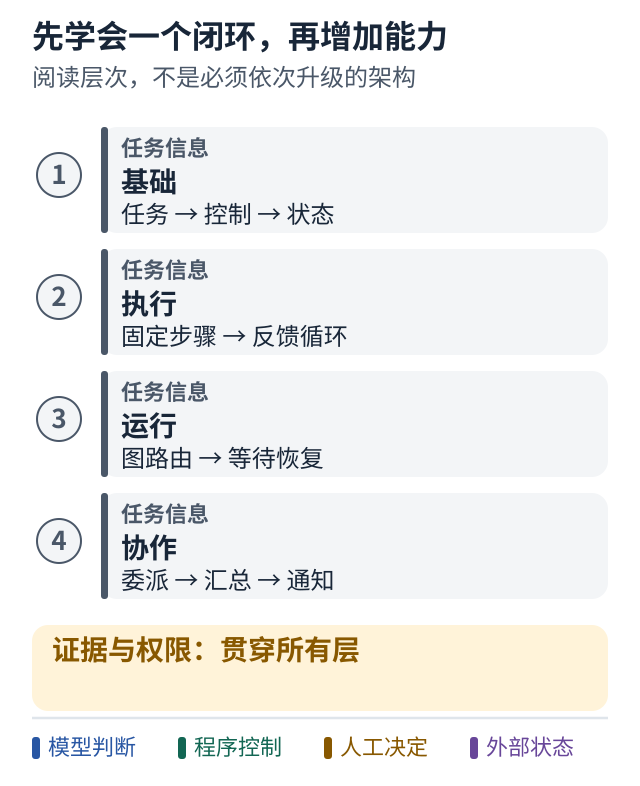

# 从 Python 流程到可协作的 Agent 系统

面向已经写过一点 Python 并接触过 Agent 框架的学习者。

你已经试过把步骤写进 Python，也接触过 LangGraph。接下来真正需要搞清楚的是：**哪些决定应该固定在程序里，哪些决定可以交给模型，以及任务中途出问题时，谁还记得发生了什么。**

本教程用 32 个短课回答这些问题。每课只推进一个中心概念，细节通过同一个修复任务逐步展开。读完后，你应该能够自己画出一个可执行的设计，解释为何选择某种框架，并辨认“能演示一次”和“能长期承担工作”之间缺少的部件。

项目场景用于提供真实问题与约束，不预设现有架构已经完整或合理。案例会分别说明当前做法的价值、失效条件、可选改造与验证方法。单 Agent、固定流程和多 Agent 都可能是正确选择，取决于任务。

## 图解：先学会一个闭环，再增加能力

跟着图走：

1. 先沿前两层理解一个人也能完成的修复任务。
2. 再按实际需要学习恢复与协作；最下面的证据和权限贯穿全程。

图的范围：学习导航：这些是阅读层次，不是每个系统必须依次升级的架构。

## 从哪里开始

- **第一次系统学习**：按 01–32 顺序读。每读完一部，完成一小次练习，不急着安装更多框架。
- **先通过源码理解设计**：先读 01–04，再读 09–12，然后回到 05 顺读。
- **主要困惑是 LangGraph**：先读 02、04、06，再读 13–16。没有状态模型，图只会把困惑画出来。
- **想做数字员工**：先读 17–24，再回看 25–30 的可靠性与设计取舍。
- **想马上动手**：进入 [离线示例说明](examples/README.md)。先用没有模型、没有 API key 的小实验看清控制流。

每课约需 5–12 分钟；代码实验和练习另计。时间仅作阅读安排参考。

每课底部的小练习在 [第 32 课](lessons/32-solutions.md) 按相同编号提供答案与理由；先尝试再查。可运行实验和框架示意分开存放，避免把未运行的 API 片段误当成已验证教程代码。

## 怎样使用图解

教程新增 36 张本地 SVG 图解，直接在 GitHub 页面展示，无需运行代码。每张图只讲一个关键机制，并配有 2–3 步阅读提示。颜色辅助识别角色，文字标签才是含义依据。图中的缩减模型、源码事实和改造建议均在图下标明。

- 按课程读时，先读问题，再沿图走一遍，最后检查反例或小练习。
- 回顾某个机制时，打开 [图解索引](references/visual-index.md)。图中文字过小时，可以点击图片查看原图。
- 恢复、权限和消息图是理解协议的入口，不能替代实际故障测试。

## 学习路线

### 第一部 先建立共同语言

1. [一个任务怎样才算完成](lessons/01-task-and-done.md)
2. [究竟是谁决定下一步](lessons/02-control.md)
3. [模型 工具 Agent 与编排](lessons/03-model-tool-agent.md)
4. [状态让任务有了记忆](lessons/04-state.md)

### 第二部 先不用框架看清流程

5. [写出一条固定 Python 流程](lessons/05-python-workflow.md)
6. [把流程变成反馈循环](lessons/06-agent-loop.md)
7. [给自主性画出边界](lessons/07-bounded-autonomy.md)
8. [失败之后该重试什么](lessons/08-retry.md)

### 第三部 用公开项目理解两层控制

9. [底盘与单会话执行分别负责什么](lessons/09-repository-map.md)
10. [沿着底盘的一次任务走一遍](lessons/10-chassis-flow.md)
11. [让完成判断依赖证据](lessons/11-done-criteria.md)
12. [设计一个通用的单会话执行器](lessons/12-single-session.md)

### 第四部 再理解 LangGraph

13. [什么时候值得把流程画成图](lessons/13-why-graph.md)
14. [读懂你的第一张 StateGraph](lessons/14-first-langgraph.md)
15. [条件路由表达反馈](lessons/15-routing.md)
16. [暂停 保存与恢复](lessons/16-persistence.md)

### 第五部 从一个 Agent 到协作

17. [增加一个 Agent 要解决什么](lessons/17-why-multi-agent.md)
18. [管理者如何调用专家](lessons/18-manager-and-tools.md)
19. [消息 调用与控制权交接](lessons/19-handoff.md)
20. [并行之后怎样可靠汇总](lessons/20-parallel.md)

### 第六部 数字员工如何进入真实工作

21. [主动工作从触发器开始](lessons/21-triggers.md)
22. [通知也是需要管理的动作](lessons/22-notifications.md)
23. [把人类审批放进状态机](lessons/23-human-approval.md)
24. [给数字员工写一份岗位说明](lessons/24-digital-employee.md)

### 第七部 判断设计是否可靠

25. [用故障演练检查系统](lessons/25-failure-drills.md)
26. [评估结果而不只看演示](lessons/26-evaluation.md)
27. [控制成本 权限与上下文](lessons/27-boundaries.md)
28. [按问题选择框架](lessons/28-frameworks.md)

### 第八部 把理解变成你的方案

29. [为现有系统规划渐进改造](lessons/29-evolution.md)
30. [完整复盘一次人机协作任务](lessons/30-walkthrough.md)
31. [填写你自己的设计工作表](lessons/31-design.md)
32. [练习答案与推理方法](lessons/32-solutions.md)

## 本教程怎样使用证据

- **仓库事实**：以固定提交的文件为依据，不把愿景、README 描述或第三个项目当成已实现功能。
- **官方资料**：用于解释框架及协议能力，核对日期为 2026 年 10 月 8 日。版本会变化，安装前请重查官方文档。
- **教学模型**：为方便理解而简化，不声称已经进入你的生产系统。
- **设计建议**：给出适用前提、代价和验证方式，不把它们写成唯一正确架构。
- **运行验证**：以 [验证记录](references/verification.md) 为准。离线模拟通过不代表真实模型、Azure、GitHub、跨进程恢复或线上权限已验证。

[来源与固定提交](references/sources.md) · [术语表](references/glossary.md) · [框架与产品观察](references/products.md) · [独立练习](exercises/README.md) · [可复用设计工作表](design/worksheet.md)

## 可选短案例

建议读完第 24 课后选择一个，不必一次读完。

- [从公开底盘判断哪些抽象值得保留](cases/01-chassis-judgment.md)
- [从 Pure Agent Drive 判断单会话边界](cases/02-pure-agent-drive.md)
- [Meta Muse 怎样把主动工作与授权分开](cases/03-meta-muse.md)
- [Multica 怎样让任务板驱动 Agent 执行](cases/04-multica.md)
- [Multica 的可靠领取与唤醒](cases/05-multica-runtime.md)
- [Multica 的执行身份与权限边界](cases/06-multica-authority.md)
- [Claude Code 的工具循环与扩展部件](cases/07-claude-code-runtime.md)
- [Claude Code 的协作、会话恢复与定时运行](cases/08-claude-code-collaboration.md)
- [怎样阅读 Claude Code 的公开源码与分析](cases/09-claude-code-source-reading.md)
- [Claude Code 阅读资源与证据分级](references/claude-code-reading.md)
- [三类任务应该怎样选择架构](design/scenario-decisions.md)

## 旧版本源码精读

这条路线阅读公开历史快照的实际核心代码，以 2.1.88 为主；与前面的当前官方功能说明分开。

- [沿 queryLoop 追踪一轮任务](cases/10-historical-query-loop.md)
- [工具为什么有时并行有时排队](cases/11-historical-tool-scheduling.md)
- [子 Agent 怎样继承或隔离上下文](cases/12-historical-subagent-context.md)
- [历史源码候选与七步阅读路线](references/claude-code-historical-reading.md)

## 贯穿案例

我们使用一个**虚构的 Azure DevOps 工单 1042**：金额解析函数不能正确处理 `"1,234.50"`。系统需要读懂问题、修改代码、运行测试、准备可供人审阅的交付物，并报告结果。

这个小 bug 本身不重要。它让我们能持续追问同一组问题：谁选择下一步？测试失败怎么办？人不在线怎么办？重复收到 webhook 怎么办？模型说完成了，证据在哪里？

本仓库的示例不会连接真实 Azure DevOps，不会创建 PR、发送通知或部署。示例任务中的身份、工单、消息及事件都是教学数据。
