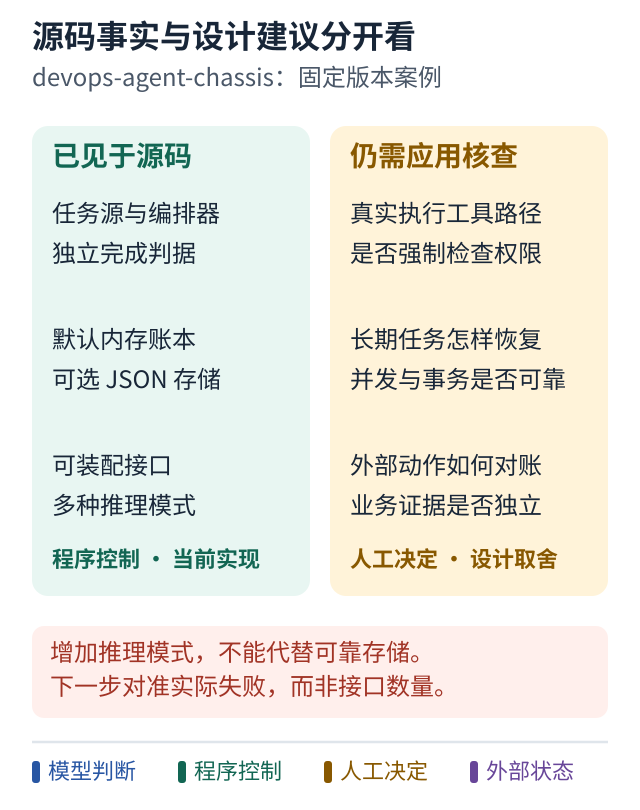

# 案例一 哪些底盘抽象值得保留

[学习路线](../README.md) · [相关课程 09](../lessons/09-repository-map.md) · [场景选择](../design/scenario-decisions.md)

## 设计问题

一个能够替换多种编排与推理模式的底盘，什么时候真的帮助你，什么时候只增加了需要理解的东西？

## 当前实现能证明什么

公开的 `devops-agent-chassis` 在指定版本中把任务源、编排器、运行上下文和完成判据分开。编排器报告成功之后，外层还有判据检查。源码中也存在多种推理模式、失败策略和配方实例化能力。[固定版本依据](../references/sources.md#r01)

这些说明它提供了可装配的接口和若干实现，不能证明某个装配已经适合长期生产任务，更不能证明每一种推理模式都会提高质量。

## 图解：源码已有什么，还需要设计什么

跟着图走：

1. 先读固定版本已存在的接口与实现。
2. 再读右侧缺口，确认它们是需要核查或新增的应用能力。
3. 把下一步对准实际失败，不把“有接口”当成生产保证。

图的范围：左侧基于正文固定版本源码；右侧是条件性设计建议，不是该版本已实现清单。

## 合理之处

如果你确实要在相同工单和验收标准下比较不同求解方式，独立 `DoneCriteria` 很有价值。它让执行器变化时，成功标准不必跟着模型自述漂移。

任务源与执行分开也便于先用静态练习任务建立基线，再接真实事件。对教学和受控实验，这比一开始连接所有业务系统更容易定位问题。

## 什么时候会不够

如果你的首要问题是重启后丢任务，新增一种推理模式不会解决它。默认内存账本以及参考 JSON 存储也不等同于有并发领取、事务和可靠消息的生产任务库。[账本边界](../references/sources.md#r05)

如果实际工具路径没有接入权限检查，存在权限接口也不保证动作受限。如果业务验收器只信任模型填入的字段，独立接口在形式上存在，却没有取得独立证据。

## 对一个窄任务的建议

以“修复一类可机械验证的静态检查问题”为例，先选一个明确规则、一个执行器、一套独立测试。确定性规则足以修复时，不必让模型反复规划。

如果规则有歧义，再把局部调查交给 Agent。业务目标、允许范围和验收保持不变。此时底盘帮助比较两种执行方式，而不是强迫每个任务使用最复杂模式。

下一步优先补真实需要的持久状态与可去重通知，再决定是否增加更多角色。成本是要设计数据库、外部效果和恢复边界；收益是解决“工作能否被持续承担”的问题。

## 怎样验证这个建议

准备同一组任务，比较固定规则、单 Agent 和增加 reviewer 三个版本。检查成功率、误改范围、证据完整度、时间及人工审查成本。

再注入重复事件和重启。只有这些数据表明新组件有价值，才扩大它的使用范围。

**可以借鉴：** 执行方式与验收合同分离。

**不要直接照搬：** 接口数量、推理模式数量或漂亮抽象本身不能作为生产成熟度指标。
