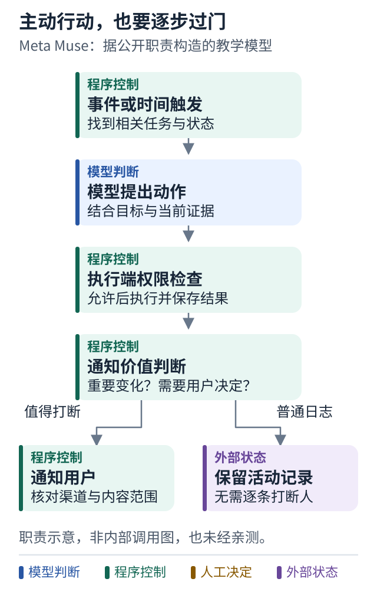

# 案例三 主动体验背后谁决定行动

[学习路线](../README.md) · [相关课程 21](../lessons/21-triggers.md) · [相关课程 24](../lessons/24-digital-employee.md)

## 设计问题

一个常驻助手可以在你离开后继续工作，又能在需要时主动找你。怎样让这种体验既连续，又不把模型判断直接变成无限权限？

## 已公开的信息

这里特指 Meta Muse。官方产品设计描述了长期主聊天、后台任务、活动可见性和在需要决定或情况变化时联系用户。官方工程说明进一步描述隔离运行环境、持久状态、凭据处理和位于执行边界的权限服务。[产品与工程来源](../references/sources.md#p03)

这些属于厂商披露，不是本教程亲测或源码审计。未公开的数据结构、算法和调度细节，不能凭体验自行补全。

## 把体验拆成可设计的步骤

下面是根据公开职责划分提出的教学模型，不是其内部调用图：

```text
事件或时间到达
  → 找到相关任务与状态
  → 启动一次有边界的执行
  → 模型提出动作
  → 执行端检查权限
  → 保存证据与结果
  → 判断是否值得通知用户
```

这个模型说明，“主动找人”和“自己决定工具调用”是两个不同问题。前者需要事件、任务状态和通知策略；后者需要工具列表、运行循环与权限检查。

## 图解：主动做事与允许做事，是两个判断



跟着图走：

1. 先由事件或时间启动一轮任务处理。
2. 模型建议必须经过动作权限检查，主动性不会带来额外权限。
3. 结果保存后再判断是否值得打断人，普通日志可以留在活动记录。

图的范围：基于 Meta Muse 官方职责描述构造的教学模型；不是其内部调用图，也未经本教程亲测。

## 值得借鉴的判断

对于个人长期任务，用户通常希望只有重要变化才被打断。于是可以把普通工具日志放进活动记录，把决策请求和关键阻塞作为高价值通知。

权限应该在动作执行点检查。模型可以建议某个操作，但批准必须对应具体目的、对象和范围，不能把一次聊天里的同意无限延伸。

将凭据处理与模型上下文分开，也能缩小模型误用敏感信息的风险。具体如何实现，需要独立安全设计，不能仅增加一句提示词。

## 代价与不应照搬的部分

常驻体验会带来持续存储、后台预算、取消、重复事件和通知疲劳问题。一个偶尔运行的本地补丁脚本，未必需要完整个人助手基础设施。

也不要根据私人助手的设计，就推断它已经解决多个人向同一资产派活的权限问题。多人系统还需要不同请求者、owner 和审批者之间的规则。

## 回到工单案例

可以借用的是“CI 变化后恢复原任务”和“需要人决定时发一次可解释通知”。不必先构建一个无所不包的长期记忆系统。

验证时重放同一 CI 事件，确认不会重复发提醒；改变候选版本，确认旧批准不会继续生效；取消任务，确认未来调度不会再启动发布动作。

**本案例的结论：** 主动体验是一组任务和事件机制的组合，授权边界需要在执行层成立。
