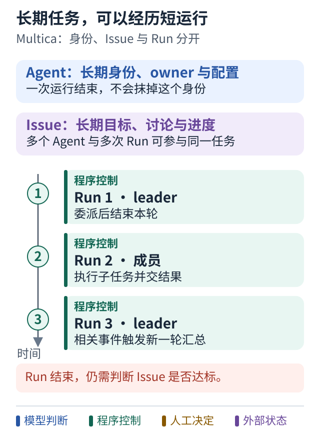
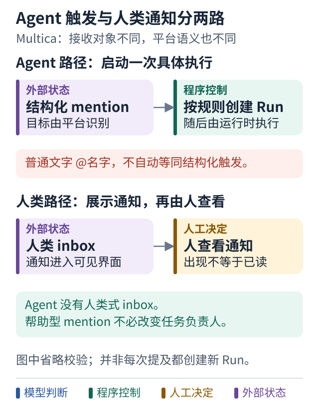

# 案例四 稳定员工身份怎样驱动短期执行

[学习路线](../README.md) · [执行可靠性进阶](05-multica-runtime.md) · [权限进阶](06-multica-authority.md)

## 设计问题

人类和多个 Agent 共用一个任务板时，怎样既保持持续协作，又不要求每个模型永远运行？

本案例研究明确的项目 [multica-ai/multica](https://github.com/multica-ai/multica)，固定提交 `8db6cfe19ae6fd5c35ec71bd8fea42a3ef3861ec`。结论来自官方文档和源码阅读，未安装运行或压力测试。

## 先分清三个对象

**Agent**是长期身份与配置：名字、owner、instructions、skills、模型和运行位置。

**Issue**是长期工作对象：目标、描述、讨论、归属与业务进度。

**Run**是一次具体执行：为什么启动、在哪里运行、结果如何。一个 Issue 可以经历多个 Run，也可以让不同 Agent 帮忙。[对象说明](../references/sources.md#p05)

这样设计以后，更换模型不必更换员工身份；一次 Run 失败，也不必抹掉整个任务。界面上的“这个员工还在”，不等于某个模型进程一直在线思考。

## 图解：长期身份与任务，可以经历多次短运行



**跟着图走：**

1. 先看贯穿全图的 Agent 和 Issue，它们不会因一次运行结束而消失。
2. 再沿时间看 leader、成员和新 leader Run，进程不必始终运行。
3. 每轮结束后仍要判断 Issue 是否达标，以及结果是否已交付。

**图的范围：**依据正文固定版本对象与 Squad 协作语义简化；具体触发和合并取决于平台规则。

## 一次团队协作怎样发生

```text
人把 Issue 分给 Squad
  → 创建 leader 的 Run
  → leader 用结构化 mention 或子 Issue 委派
  → leader 结束本轮
  → 成员获得各自 Run 并执行
  → 结果或相关事件触发新的 leader Run
  → leader 汇总 继续委派或进入审阅
```

Squad 是一个 leader 加成员与角色描述。部分协作规则通过生成给模型的操作协议表达，不能把所有规则都说成后端强制保证。例如“同一工作只选择 mention 或子 Issue 一种委派方式”，需要区分提示要求与真正的去重控制。[Squad 协议源码](../references/sources.md#p06)

结构化 mention 带有平台识别的目标信息，普通文字 `@名字` 不应被想当然视为等效执行触发。mention 请求帮助也不必改变 Issue 的 assignee。

## 最反直觉的一点

在这个版本中，Agent 没有 inbox，也不接收人类式的 `@all`。人类 inbox 用于通知；Agent mention 可以触发执行。把所有角色都画成“收信箱里来了消息，所以开始工作”，会误解实际设计。[Inbox 文档](https://github.com/multica-ai/multica/blob/8db6cfe19ae6fd5c35ec71bd8fea42a3ef3861ec/apps/docs/content/docs/inbox.mdx)

同样，Run completed 只表示这一轮执行结束。Issue 是否满足目标，需要业务判断；结果是否被人看到，需要传输或界面证据。

## 图解：执行触发与人类通知走不同路径



**跟着图走：**

1. 沿 Agent 一轨看结构化目标怎样触发一轮执行，而不是进入人类收件箱。
2. 沿人类一轨看通知怎样展示；消息出现并不能证明已经阅读。
3. 再检查 Issue 归属：请求帮助不等于转交整个任务，普通文本提及也不能直接等同结构化触发。

**图的范围：**依据 Multica 固定版本文档与源码的两条路径；图省略触发校验，不声称所有 mention 都无条件产生新 Run。

## 对你的设计有什么帮助

当多个人会修改需求、多个 Agent 会交替参与、任务跨过许多小时或天时，长期任务加短期 Run 的区分很有价值。它让评论、结果和责任都有一个稳定归属。

如果只是一个人触发一次局部修复，复制完整 Squad 与任务板可能过重。可以先在现有服务里区分 task 与 run，保留清楚的状态和结果，不必立即搬入全部产品结构。

## 怎样验证

让 leader 委派后真正退出，再用成员结果触发新一轮。检查任务仍能继续，并且重复结果不会引发无限自唤醒。

再检查一个帮助型 mention 不会擅自接管整项任务，也不会因同一工作同时创建子 Issue 和 mention 而产生两份重复工作。

**可以借鉴：**长期身份和任务，与短期执行分离。

**不要直接照搬：**多人界面和角色协议不自动带来正确授权、无重复执行或可靠验收。
