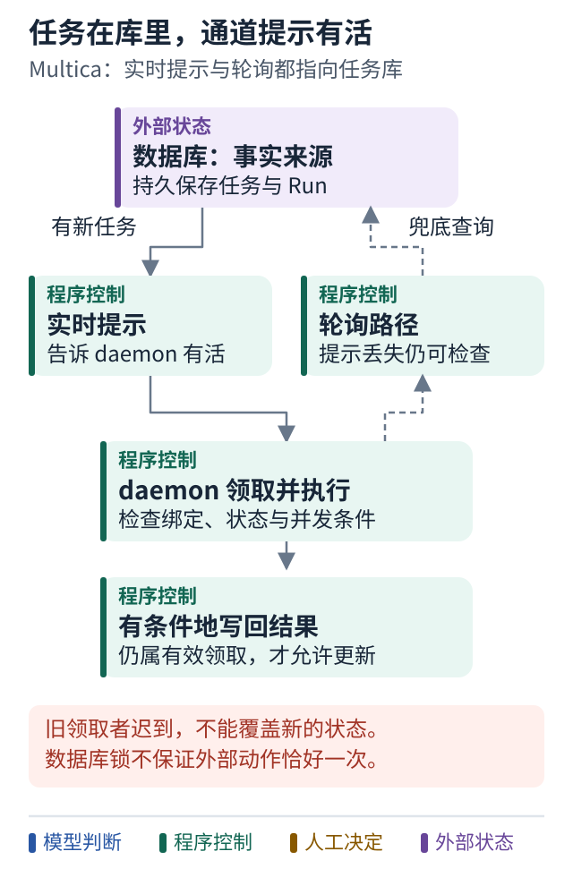

# 案例五 有活了的提示为什么不是任务本身

[Multica 主案例](04-multica.md) · [学习路线](../README.md) · [权限进阶](06-multica-authority.md)

## 设计问题

任务已经排队，但唤醒通知丢了；或者 worker 已经领取任务，领取结果却没有成功返回。系统该怎样继续？

这是进阶阅读，可以在第 25 课故障演练之后再看。不需要先学完所有 SQL 术语。

## 数据库保存任务 通道提示有活

Multica 的控制面保存任务与 Run，连接电脑上的 daemon 执行编码工作。实时通知通过 daemon 通道提示新任务，连接失败还保留轮询路径。[通知与唤醒源码](../references/sources.md#p06)

关键区别是：任务的持久记录在数据库里，实时提示不承担唯一事实来源。提示丢失可能延迟执行，但不应该使已保存的任务从系统消失。

这也是为什么不能看见 Redis relay 就说“Redis 是它的任务队列”。转发提示、保存任务、进程内发布事件，是不同职责。

## 图解：任务保存在库里，实时通道只提示有活

跟着图走：

1. 先定位事实来源：任务和 Run 记录保存在数据库。
2. 分别跟随实时提示和轮询路径，理解提示丢失为什么不等于任务消失。
3. 写回结果时检查领取仍有效；不能从数据库锁推断外部动作恰好一次。

图的范围：依据正文固定版本运行机制缩减，省略实际领取条件；不是 Redis 任务队列示意。

## 多个领取者怎样避免抢同一行

源码中的领取 SQL 使用 `FOR UPDATE SKIP LOCKED`。可以先把它理解为：事务锁住正在领取的任务行，其他领取者跳过被锁住的行，去看别的任务。

领取还会更新状态，检查 runtime 绑定和并发条件。相同 issue 与 Agent 的串行约束，和不同 Agent 可并行执行，是不同粒度的规则。[领取 SQL](https://github.com/multica-ai/multica/blob/8db6cfe19ae6fd5c35ec71bd8fea42a3ef3861ec/server/pkg/db/queries/agent.sql#L749-L810)

这解决一类数据库竞争，不能据此推断 PR、通知或其他外部影响永远恰好发生一次。

## 旧领取者回来时怎么办

系统可能回收过期领取，再让新一轮继续。如果旧 handler 迟到，还能无条件写结果，就会覆盖新状态。

因此相关更新需要检查“我是否仍然属于这次有效领取”。源码使用运行位置、领取时间等条件以及锁或条件更新来约束这类路径。[领取收尾源码](../references/sources.md#p06)

这类条件更新常被叫作 CAS，可以理解成“只有当前值还是我预期的样子，才允许修改”。先理解它防止旧执行者覆盖新状态的用途，不必一开始背缩写。

## 长任务怎样有条件地再醒来

Issue Wakeup 支持事件或时间触发，以及条件、到期时间和最多触发次数。相关实现还会合并适合并入已有待执行 Run 的输入，并避免某些自己已知的事件引发新一轮。[Wakeup 源码](../references/sources.md#p06)

这为“等子任务完成再回来”提供一种实现。它比每分钟无条件告诉模型“继续”更有目标，但仍需测试取消、过期和重复事件。

## 什么时候值得借鉴

当你已有多个 worker、经常重启、需要可靠等待时，这些机制开始重要。单个离线演示可以先不用完整分布式领取协议，但应清楚承认它的适用范围。

**验证重点：** 领取回包丢失、旧 worker 迟到、唤醒提示丢失、重复事件、取消后定时器到期。

**本案例的结论：** 持久任务保存事实，调度与通知促进执行，两者要能在故障后重新对齐。
