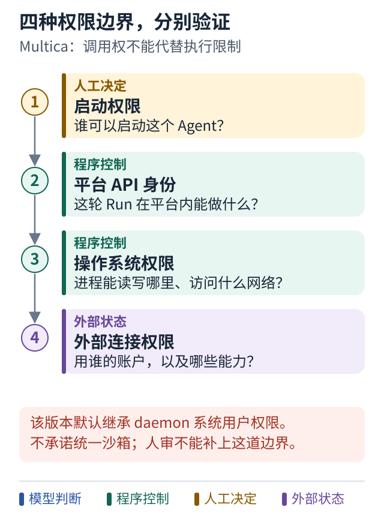

# 案例六 能启动 Agent 不代表能安全执行任何动作

[Multica 主案例](04-multica.md) · [Meta Muse 案例](03-meta-muse.md) · [学习路线](../README.md)

## 设计问题

甲让乙拥有的 Agent 做事，这个 Agent 又使用乙的应用连接。谁发起、谁负责、谁授权，以及实际用了谁的权限？

## 一次执行可能有不同身份

Multica 区分调用授权来源与审计归属。Agent owner、发起者和运行责任的记录不能简单压成一个“当前用户”。第三方连接的相关代码还明确使用 Agent owner 的连接，并按 owner 允许的能力筛选。[固定版本身份和连接源码](../references/sources.md#p07)

用教学名字来想：甲发起任务，乙拥有助手，助手使用乙允许共享的服务连接。即使甲有权启动这个助手，也不意味着甲可以让它执行乙没有允许的任何动作。

因此，共享 Agent 应配套明确的岗位与工具范围。只共享“可调用”而没有表达它能接触哪些资产，会让用户很难判断授权后果。

## 四种边界分别回答什么

- 调用权限：谁可以启动这个 Agent？
- 应用 API 身份：这个 Run 可以在平台内做什么？
- 操作系统权限：执行进程可以读写哪些文件和访问什么网络？
- 外部服务权限：这次动作实际使用哪个账户的哪些能力？

任务最后进入 `in_review`，只说明交付流程需要审阅，不会自动限制进程此前的所有工具动作。

## 图解：四种权限边界，要分别验证

**跟着图走：**

1. 先验证请求者有权启动，再看这轮运行的平台身份。
2. 继续追到操作系统和外部账户，检查真正限制动作的位置。
3. 不要把最后的人审状态当作执行期间的沙箱。

**图的范围：**Multica 固定版本默认 Run 具有 daemon OS 用户完整权限，不承诺统一文件系统沙箱；Muse 的公开安全保证不可借用。

## 这个版本需要特别注意的前提

Multica 官方安全文档说明，默认 Run 具有 daemon 所在操作系统用户的完整权限，产品不承诺统一文件系统沙箱。具体平台存在差异，但不能把默认本地执行理解为天然受限。[固定版本安全模型](https://github.com/multica-ai/multica/blob/8db6cfe19ae6fd5c35ec71bd8fea42a3ef3861ec/apps/docs/content/docs/security-model.mdx)

因此，学习其任务调度设计，不等于应该在一台存有重要凭据的日常电脑上按默认权限无条件运行多人请求。需要根据风险选择专用系统用户、容器或虚拟机，并核对工具、网络和连接权限。

## 与 Muse 的差别应保留

Muse 官方工程说明描述了独立权限执行部件和出站检查；Multica 的上述默认宿主权限假设不同。二者能提供相似的“帮我持续做事”体验，却不能互相借用对方的安全保证。

这也提醒我们：产品体验层的相似，不能证明运行边界相似。

## 上下文也需要归属

Multica 可见设计使用 Issue、评论、资源、skills 和会话延续等上下文。源码还选择默认关闭某种原生自动记忆路径，避免形成平台之外的第二份跨任务状态。[上下文与记忆源码](../references/sources.md#p08)

可以借鉴的原则是让信息来源和可见范围可解释。不能因为“长期记忆听起来更聪明”，就让不同任务和工作区无条件共享历史。

## 怎样验证

先测试无权用户能否启动 Agent，再测试有启动权但没有目标动作权限的人能否越界。然后撤销某项连接权限，检查后续 Run 是否仍沿用旧能力。

最后检查跨任务检索是否会带出另一个工作区的信息。每个测试都对应不同边界，不能只用一次登录测试代替。

**本案例的结论：**身份追踪是起点，真正的动作边界必须在运行环境和服务权限上成立。
