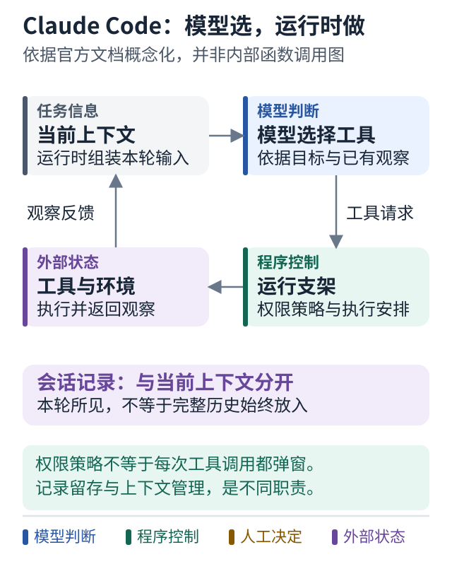
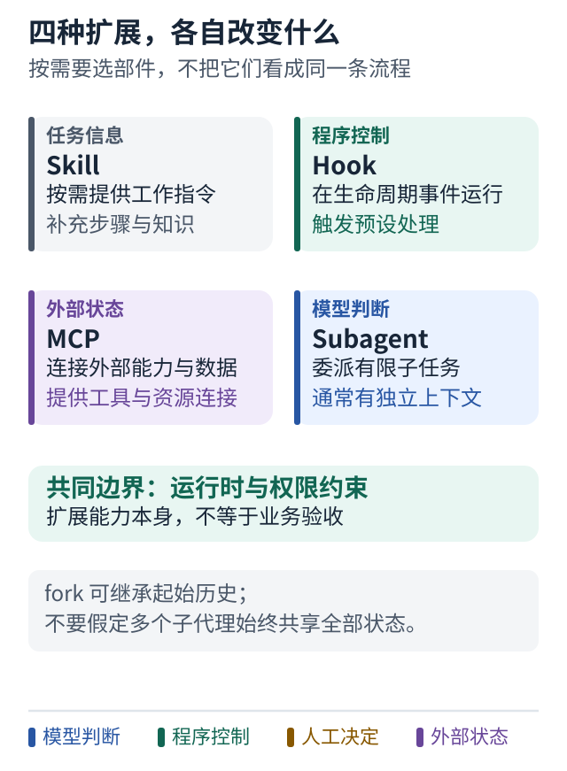

# 案例七 Claude Code 怎样在一个会话里修好测试

[协作案例](08-claude-code-collaboration.md) · [源码阅读路线](09-claude-code-source-reading.md) · [学习路线](../README.md)

## 先给一个小任务

假设登录测试偶尔失败。你要求：“找到原因，修复后运行相关测试，告诉我改了什么；不要提交或部署。”

这不是固定的“读文件 → 改文件”流水线。第一次测试可能暴露时间依赖，也可能暴露测试环境问题。下面是教学推演，行为边界依据 **2026-10-08 核对的官方文档**，不是本教程实测。

## 模型决定路线，运行时负责执行

### 图解：Claude Code：模型选择，运行支架落实

跟着图走：

1. 先跟随模型的工具选择，真正执行前由运行支架处理权限与执行。
2. 把工具观察带回下一轮，理解为什么这是反馈循环。
3. 区分当前上下文与会话记录：模型这一轮看到的内容，不等于全部历史永远完整放入。

图的范围：依据 2026-10-08 核对的 Claude Code 官方文档概念化；不声称掌握闭源运行时的实际函数或完整内部调用图。权限策略不等于每次调用都弹出审批。

一次可能的过程是：

1. 模型提出运行测试；运行时检查权限，再执行允许的命令。
2. 测试返回失败日志；模型据此选择要读的文件。
3. 读到时间判断后，模型提出修改；工具执行并返回结果。
4. 模型再次运行测试，发现另一处失败，再调整方案。

工具结果不是给用户看的附属日志，它是下一步决策的输入。Claude Code 官方将模型周围提供工具、管理上下文的这一层称为 harness。上面描述的是机制，不是其私有源码的函数调用图。[官方运行原理](https://code.claude.com/docs/en/how-claude-code-works)

这里有两个不能混淆的判断：“模型想运行命令”和“运行时允许命令”。权限决定动作能否继续；沙箱限制获准进程能读写哪里、访问哪些网络。审批通过不代表脱离沙箱，提示词里写“别乱改”也不是操作系统隔离。[权限](https://code.claude.com/docs/en/permissions) · [沙箱](https://code.claude.com/docs/en/sandboxing)

## 四种扩展，各做一件事

### 图解：四种扩展部件，各自改变什么

跟着图走：

1. 先按目的选部件：要补工作知识，还是在某个事件执行逻辑？
2. 再区分连接能力与委派执行：MCP 提供连接，subagent 承担子任务。
3. 不要把 skill 当作自动新增一个 Agent，也不要把 hook 或工具连接当作业务验收。

图的范围：依据 2026-10-08 核对的官方扩展说明。子代理通常使用独立上下文；fork 可继承起始历史，不能据此假定始终共享全部状态。

假设团队还想把这套检查方法复用：

- **Skill** 写明登录问题的检查方法，按需加载；它是一份工作说明，不自动等于另一个 Agent。
- **Hook** 在约定事件发生时运行处理，例如编辑后记录检查信息；不是等模型想起来才做。
- **MCP** 提供外部问题单或测试服务的连接；连接本身不决定调查路线。
- **Subagent** 接走一项独立调查，在自己的上下文中工作，再交回结果。

这些职责可以组合，不是四套互相替代的编排框架。具体配置会影响加载时机、权限和上下文成本。[官方扩展说明](https://code.claude.com/docs/en/features-overview)

## 这种设计为什么灵活，又在哪里会失手

**灵活之处：** 遇到未知失败时，不必预先写好每一条调查分支；新观察可以改变路线。

**代价：** 模型可能误读日志、做无关修改，或在上下文压缩后丢失细节。官方说明压缩并非无损记忆；重要项目约束应有持久来源。[上下文与会话](https://code.claude.com/docs/en/how-claude-code-works#the-context-window)

本案例的独立判断是：不要用“它很自主”代替验收。结束时检查代码差异、测试所对应的版本，以及哪些测试没有运行。测试工具成功返回，也不自动证明登录业务正确。

## 小练习

模型说“已修复”，但最后一次测试运行在修改之前。应让它继续哪一步？为什么仅检查最终回答无法发现这个问题？

**带走一句话：一个会话可以灵活安排很多动作，但决策、执行权限和结果验收仍是三件事。**
