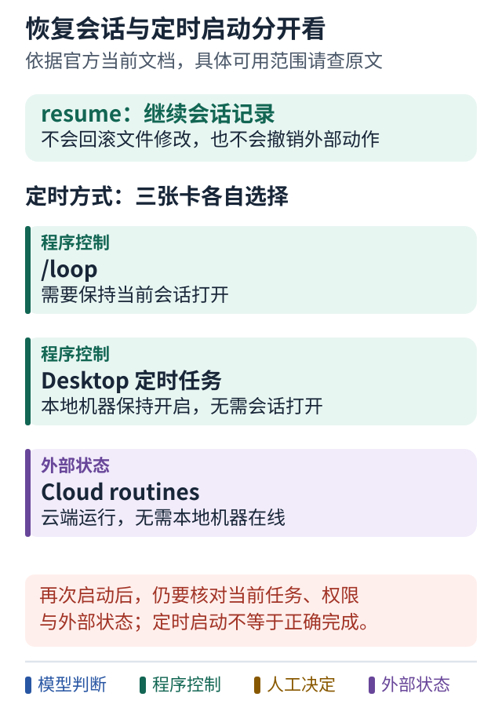

# 案例八 从两个调查员到持续运行的任务

[运行原理](07-claude-code-runtime.md) · [源码阅读路线](09-claude-code-source-reading.md) · [学习路线](../README.md)

## 同一个问题，不一定需要一支团队

继续上一例：登录失败可能来自时钟，也可能来自缓存。主会话可以让两个 subagent 分别查证，然后自己综合证据。任务应说清调查范围、允许动作和交回什么；“帮我看看”容易让两个调查员重复工作。

普通 subagent 默认从委派信息建立独立上下文，fork 则继承已有会话。隔离能减少主会话的细节负担，也意味着未写进任务的假设可能丢失。当前文档支持后台完成通知、命名和嵌套；不能套用旧教程中“子 Agent 永远不能继续委派”的说法。[当前 subagent 文档](https://code.claude.com/docs/en/sub-agents)

## 谁决定下一步，是选择协作方式的关键

- **几项探索性调查：** 主会话看结果，再决定是否继续委派。适合分支尚不清楚的任务。
- **大量同类检查：** dynamic workflow 把循环、分支和中间结果放到 JavaScript 编排脚本中，由运行时执行。它让调度可检查、可重跑，但不保证每个模型判断都正确。[官方 workflow 说明](https://code.claude.com/docs/en/workflows#when-to-use-a-workflow)
- **需要持续相互讨论的工作：** agent team 由 lead 协调独立队友。当前仍是实验功能，默认关闭；交互会话需要开启 `CLAUDE_CODE_EXPERIMENTAL_AGENT_TEAMS=1`。`-p` 和 SDK 会话不因此获得同样的队友启动行为。[官方 teams 说明](https://code.claude.com/docs/en/agent-teams)

因此，不要仅凭“有多个 Agent”判断架构。对这个登录故障，两个有明确范围的调查员可能已经够用；增加队友还会增加协调、上下文和文件冲突成本。

## 通知告诉你发生了什么，不等于任务已验收

后台 worker 完成通知、其他会话发来的消息、定时检查，是不同机制。当前跨会话通信让 Claude 用 `ListAgents` 找目标、用 `SendMessage` 发送文本；接收方仍按自己的权限处理，不会自动取得发送方全部文件和历史。[官方跨会话通信](https://code.claude.com/docs/en/cross-session-messaging)

“调查员结束了”只能触发下一步核验，不能直接把“登录问题已解决”写成成功。主会话仍应检查证据是否属于当前代码。

## 等待到明天，由谁继续

### 图解：恢复会话与定时启动，是两个能力

跟着图走：

1. 先看 resume：恢复的是对话连续性，已经修改的文件和外部动作不会因此撤销。
2. 再按运行地点选定时方式，比较它依赖会话还是本地机器。
3. 被再次启动后重新核对当前状态、权限和结果；能定时启动不等于任务已正确完成。

图的范围：依据 2026-10-08 核对的 Claude Code 官方当前文档；功能与可用范围会变化，安装前查原文。不把内置定时能力误写为只能依赖第三方。

如果修复需要等明天的长测结果，就要选择谁拥有等待责任：

- `/loop` 在打开的会话中定时检查。
- Desktop scheduled task 不要求会话保持打开，但要求机器开着。
- Cloud routine 可以不依赖本地机器运行。

这是同一产品中的不同生命周期选择，不能笼统说“Claude Code 没有持续任务”。[官方调度比较](https://code.claude.com/docs/en/scheduled-tasks#compare-scheduling-options)

也不要把 `--resume` 当成恢复整个世界：它延续会话，不证明旧测试进程、外部部署或队友仍在运行。官方还明确列出 in-process teammates 不随 resume 恢复的限制。[会话管理](https://code.claude.com/docs/en/sessions) · [teams 限制](https://code.claude.com/docs/en/agent-teams#limitations)

## 怎样做独立判断

先问三个问题：下一步由模型还是脚本决定？中间状态存在哪里？会话或机器消失后，谁核对真实状态并继续？

本例的建议是先用少量只读调查分工；重复且规模大的检查再考虑脚本；需要跨会话等待时明确调度和结果归属。三者可以组合，不必选一个品牌来替代设计。

**版本范围：** 官方页面核对于 2026-10-08；功能受版本、计划和运行模式影响，具体变化见[阅读索引](../references/claude-code-reading.md)。本教程未运行这些功能。

**带走一句话：并行、通信和持久运行是不同能力，分别找出负责它们的机制。**
