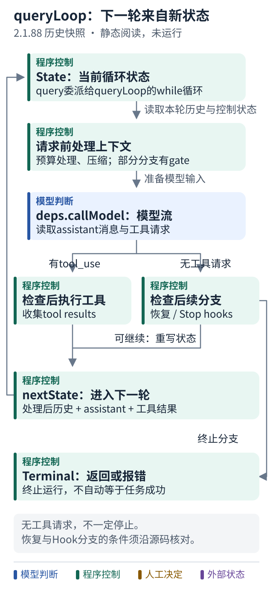

# 案例十 沿历史源码读一次 queryLoop

[当前运行原理](07-claude-code-runtime.md) · [下一篇：工具调度](11-historical-tool-scheduling.md) · [固定版本与阅读顺序](../references/claude-code-historical-reading.md)

## 先把镜头固定

这里实际阅读的是社区保存、标为 **2.1.88** 的 source-map 提取快照，固定提交 `a8a678cb6244e6770e1e421767ff0987a1d95549`。它不是官方开源发布，也不是当前安装版本。来源核验与局限集中写在[历史阅读索引](../references/claude-code-historical-reading.md)，本篇只追一个问题：** 这一轮怎样进入下一轮？**

## 从两个入口开始

打开 [query.ts 的 query](https://github.com/ChinaSiro/claude-code-sourcemap/blob/a8a678cb6244e6770e1e421767ff0987a1d95549/restored-src/src/query.ts#L219-L238)。它是外层异步生成器，委托给 `queryLoop`，正常返回后处理已消费命令的完成通知。再读 [queryLoop 的 State 与 while](https://github.com/ChinaSiro/claude-code-sourcemap/blob/a8a678cb6244e6770e1e421767ff0987a1d95549/restored-src/src/query.ts#L241-L307)：这版用显式状态循环，不能因为日志仍写着“recursive_call”就断言它仍靠函数递归。



跟着图走：

1. 把 State 当成本轮工作的输入，先经过上下文处理，再请求模型。
2. 工具结果和恢复信息都可能构成下一轮输入。
3. 找到返回 Terminal 的分支，不能只盯着模型有没有调用工具。

## 模型调用在哪里

[query/deps.ts](https://github.com/ChinaSiro/claude-code-sourcemap/blob/a8a678cb6244e6770e1e421767ff0987a1d95549/restored-src/src/query/deps.ts#L22-L38) 把 `deps.callModel` 映射到 `queryModelWithStreaming`，把两种 compact 依赖映射到实际实现。它是依赖注入边界，方便替换测试依赖，不是多出来一个 Agent。

[调用处](https://github.com/ChinaSiro/claude-code-sourcemap/blob/a8a678cb6244e6770e1e421767ff0987a1d95549/restored-src/src/query.ts#L655-L707) 传入消息、系统上下文、工具、模型、权限上下文读取函数和取消信号。模型流产生 assistant 消息后，[提取 tool_use](https://github.com/ChinaSiro/claude-code-sourcemap/blob/a8a678cb6244e6770e1e421767ff0987a1d95549/restored-src/src/query.ts#L826-L861)，需要时交给工具执行器。

下面只是本教程原创的控制流示意，不是源码转写，也不可运行：

```text
重复：
    准备本轮上下文
    接收模型事件
    若有工具工作：执行获准工具，收集观察
    否则：尝试允许的恢复，并检查停止条件
    要继续：建立下一份状态
    要结束：返回终止原因
```

## “没有工具”为什么还不一定结束

[1062–1182 行](https://github.com/ChinaSiro/claude-code-sourcemap/blob/a8a678cb6244e6770e1e421767ff0987a1d95549/restored-src/src/query.ts#L1062-L1182) 会处理被暂缓展示的上下文超限错误：有条件地尝试 collapse、reactive compact；成功则替换状态重试，失败则返回错误。恢复标记避免同一路径无穷重试。

[1262–1305 行](https://github.com/ChinaSiro/claude-code-sourcemap/blob/a8a678cb6244e6770e1e421767ff0987a1d95549/restored-src/src/query.ts#L1262-L1305) 中，普通回答还要经过 Stop hooks；阻塞反馈能追加为消息，促成下一轮。API 错误另走退出处理，避免错误、Hook 阻塞、上下文更大、再出错的循环。部分恢复受功能开关控制；静态分支存在不证明线上必然开启。

有工具时，[1715–1727 行](https://github.com/ChinaSiro/claude-code-sourcemap/blob/a8a678cb6244e6770e1e421767ff0987a1d95549/restored-src/src/query.ts#L1715-L1727) 用“预处理后的消息 + assistant 消息 + 工具结果”建立下一份 State。关键是“预处理后”：历史可能已被压缩，不能总把原始数组无限追加。

## 带着问题回到自己的程序

对照[第六课 Agent 循环](../lessons/06-agent-loop.md)、[第八课重试](../lessons/08-retry.md)、[第四课状态](../lessons/04-state.md)：你的代码区分网络重试、工具失败后的重新决策、上下文恢复了吗？

小练习：模型没有 tool_use，但 Stop hook 给出阻塞反馈。这一轮该返回成功还是继续？沿链接找出新状态增加了什么。

