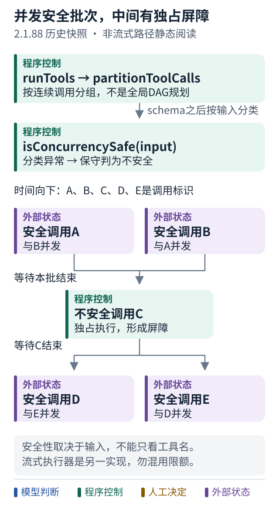

# 案例十一 并发工具前，先找屏障与权限关卡

[主循环](10-historical-query-loop.md) · [下一篇：子代理上下文](12-historical-subagent-context.md) · [当前权限与运行边界](07-claude-code-runtime.md)

本篇继续精读同一份 **2.1.88 历史快照**。先问“哪些调用可以重叠”，再问“每个调用凭什么执行”。这两个判断不是同一件事。

## 不按工具名字猜并发安全

打开 [toolOrchestration.ts](https://github.com/ChinaSiro/claude-code-sourcemap/blob/a8a678cb6244e6770e1e421767ff0987a1d95549/restored-src/src/services/tools/toolOrchestration.ts#L19-L115)。`runTools` 先经 `partitionToolCalls` 分批：解析输入成功后，询问工具的 `isConcurrencySafe(input)`。分类抛异常或解析失败，都保守地归入非并发安全。

连续的安全调用合为一批；不安全调用形成串行屏障。A、B 安全，C 不安全，D、E 安全，执行顺序就是 A/B 并发 → C → D/E 并发。不能因为名字叫 Read 就跳过实际分类。

跟着图走：

1. 横向看批次，C 必须独占，后面的批次不能越过它。
2. 回看分类入口：由解析后的输入与工具规则决定安全性，而非只看名字。
3. 这张批次图说明非流式路径；流式执行器另有队列实现。

这条非流式路径默认并发上限为 10，可由环境变量调整。并发批次产生的 context modifiers 会先收集，再按原工具顺序应用，避免把完成先后直接当作状态更新顺序。

## 流式执行不是把所有工具一起启动

主循环在开关允许时使用 [StreamingToolExecutor](https://github.com/ChinaSiro/claude-code-sourcemap/blob/a8a678cb6244e6770e1e421767ff0987a1d95549/restored-src/src/services/tools/StreamingToolExecutor.ts#L104-L150)：模型事件里出现工具调用即可入队。只有当前运行者和新调用都允许并发，才可重叠；遇到等待独占执行的调用，要保持屏障顺序。

主循环先取已完成结果，[流结束后再排空余下结果](https://github.com/ChinaSiro/claude-code-sourcemap/blob/a8a678cb6244e6770e1e421767ff0987a1d95549/restored-src/src/query.ts#L1380-L1408)。不要把非流式路径的并发上限未经检查套在流式实现上，也不要把功能开关存在说成所有用户都已启用。

## 真正的执行边界在工具调用前

沿 [toolExecution.ts](https://github.com/ChinaSiro/claude-code-sourcemap/blob/a8a678cb6244e6770e1e421767ff0987a1d95549/restored-src/src/services/tools/toolExecution.ts#L599-L635) 往下读：

- 输入 schema 验证，随后进行工具自己的处理与 Hook 流程
- [解析权限决定](https://github.com/ChinaSiro/claude-code-sourcemap/blob/a8a678cb6244e6770e1e421767ff0987a1d95549/restored-src/src/services/tools/toolExecution.ts#L916-L1037)
- 非 allow 产生关联原调用 ID 的错误结果
- 处理更新后的输入，最终才到 [tool.call](https://github.com/ChinaSiro/claude-code-sourcemap/blob/a8a678cb6244e6770e1e421767ff0987a1d95549/restored-src/src/services/tools/toolExecution.ts#L1181-L1220)

所以，模型输出的工具调用是动作请求；运行支架负责是否执行。权限拒绝也应变成模型可理解的观察，不能伪装成成功。这里没有声称所有模式都弹人工审批，也没有完成整个权限系统的安全审计。

## 与更早快照比较，别混版本

此前已读取的、标为 **0.2.8** 的独立公开快照，`query.ts` 使用更粗的策略：同一批全是只读工具才并发，否则整批串行。2.1.88 这里是输入相关的连续批次分类。这个差异只描述两份已读历史材料；早期来源及原仓库访问限制见[来源记录](../references/claude-code-historical-reading.md#五类候选不要混成一种源码)。

练习：A、B 并发安全；C 不安全且最后权限被拒；D 安全。请分别回答“调度什么时候允许 D 开始”和“C 是否发生外部效果”。对照[第二十课并行](../lessons/20-parallel.md)、[第二十三课人工审批](../lessons/23-human-approval.md)。

