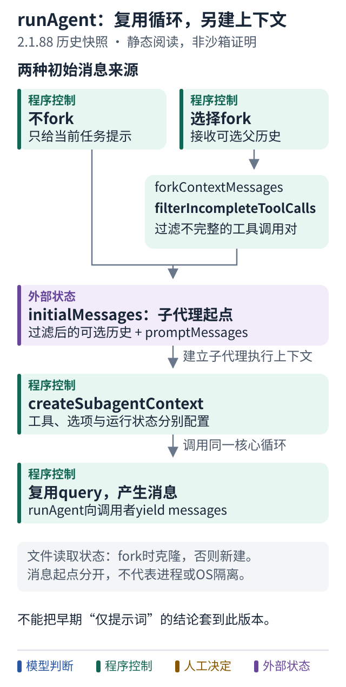

# 案例十二 子代理复用循环，却不必共享全部历史

[工具调度](11-historical-tool-scheduling.md) · [当前协作方式](08-claude-code-collaboration.md) · [历史阅读索引](../references/claude-code-historical-reading.md)

继续读 **2.1.88 历史快照**。问题不是“有没有 subagent”，而是：它从哪里获得消息、哪些状态单独建立、结果怎样回到调用者？

## 先找 initialMessages

[runAgent.ts 368–378 行](https://github.com/ChinaSiro/claude-code-sourcemap/blob/a8a678cb6244e6770e1e421767ff0987a1d95549/restored-src/src/tools/AgentTool/runAgent.ts#L368-L378) 给出两个入口：

- 没有 `forkContextMessages`：以传入的 promptMessages 起步
- 有 fork：先过滤不完整的工具调用，再把保留的历史与 promptMessages 合并

为什么过滤？消息里的 tool_use 如果没有配对的 tool_result，会让继承的对话成为不完整轨迹。读[过滤函数](https://github.com/ChinaSiro/claude-code-sourcemap/blob/a8a678cb6244e6770e1e421767ff0987a1d95549/restored-src/src/tools/AgentTool/runAgent.ts#L862-L904)，看它如何确定哪些调用已有结果。

跟着图走：

1. 区分“新消息列表”和“继承起点”，fork 不等于永久共享可变历史。
2. 文件读取状态在 fork 时克隆，否则新建；工具与权限上下文另行配置。
3. 子代理仍进入同一个 query 循环，消息边界本身不是操作系统沙箱。

## 谁在调用同一个循环

[697–757 行](https://github.com/ChinaSiro/claude-code-sourcemap/blob/a8a678cb6244e6770e1e421767ff0987a1d95549/restored-src/src/tools/AgentTool/runAgent.ts#L697-L757) 建立 `createSubagentContext`，设置 agentId、消息、选项、取消控制等，再调用 `query`。同步和异步分支的状态共享选项不同，不能简化成“全部共享”或“什么都不共享”。

`runAgent` 持续 yield 消息，并记录可保存的事件。它不是一个只返回最终字符串的函数。[finally 部分](https://github.com/ChinaSiro/claude-code-sourcemap/blob/a8a678cb6244e6770e1e421767ff0987a1d95549/restored-src/src/tools/AgentTool/runAgent.ts#L816-L847) 还清理子代理 MCP、Hooks、读取缓存及关联后台任务。对象活多久，也是编排的一部分。

## 谁把子结果变成父工具结果

回到 [AgentTool 的同步结束分支](https://github.com/ChinaSiro/claude-code-sourcemap/blob/a8a678cb6244e6770e1e421767ff0987a1d95549/restored-src/src/tools/AgentTool/AgentTool.tsx#L1229-L1260)：它调用 `finalizeAgentTool`，包装 completed 状态。随后 [mapToolResultToToolResultBlockParam](https://github.com/ChinaSiro/claude-code-sourcemap/blob/a8a678cb6244e6770e1e421767ff0987a1d95549/restored-src/src/tools/AgentTool/AgentTool.tsx#L1327-L1373) 把完成内容映射成带 `tool_use_id` 的结果；空输出有专门标记。

同一映射函数还区分 async_launched：启动确认和任务完成不是同一个状态。这里只证明快照中存在这些分支，不证明每个远程或团队功能已对普通用户启用。

## 压缩会改变消息，但不是停止开关

延伸读 [autoCompactIfNeeded](https://github.com/ChinaSiro/claude-code-sourcemap/blob/a8a678cb6244e6770e1e421767ff0987a1d95549/restored-src/src/services/compact/autoCompact.ts#L241-L349)：它检查是否需要压缩，尝试压缩，成功时清零失败计数，失败时增加计数。超过连续失败阈值后，后续压缩尝试返回“不压缩”；**这不等于整个 Agent 自动终止**。全局何时退出，仍要回到案例十的主循环。

对照更早已读的 0.2.8，AgentTool 只用一个任务 prompt 新建历史，再把最终 assistant 的文本作为结果。不要把这个旧约束沿用为所有版本的“子代理原理”。

小练习：父历史最后有未完成 tool_use，子任务选择 fork。应该整段原样复制吗？子代理返回 async_launched，父代理能说任务完成吗？结合[第十七课多 Agent](../lessons/17-why-multi-agent.md)、[第十八课管理者与工具](../lessons/18-manager-and-tools.md)、[第二十七课边界](../lessons/27-boundaries.md)回答。

