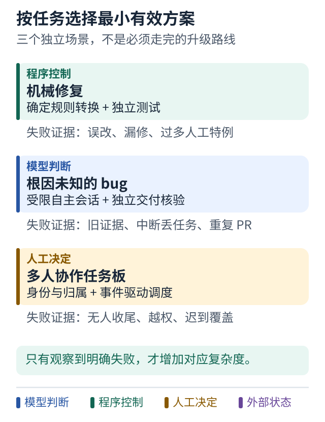

# 三类场景怎样选择架构

[学习路线](../README.md) · [设计工作表](worksheet.md)

这份比较是设计建议，不是对任何现有项目生产能力的确认。假设三个场景都已有明确任务授权，具体发布和共享仍按各自权限处理。

| 场景 | 第一版可以怎样做 | 什么时候增加复杂度 | 需要观察的失败证据 |
|---|---|---|---|
| 一类 Sonar 或静态检查机械修复 | 确定规则转换 加独立测试；规则有歧义时才调用模型 | 无法枚举的上下文判断增多时加入受限调查循环 | 规则误改 漏修 需要大量人工特例 |
| 根因未知的 bug 修复 | 一个受限自主会话 加明确输入和独立交付核验 | 有长时间 CI 人工测试和版本审批时增加显式持久阶段 | 旧证据复用 中断后丢任务 重复 PR |
| 多个人与多个 Agent 使用任务板 | 明确任务身份 分配者 执行者 owner 与审批者，按事件调度 | 真有并行负责人时增加异步消息与更细所有权 | 任务无人收尾 越权借用凭据 迟到结果覆盖新任务 |

## 图解：三种任务，分别从最小有效方案开始

**跟着图走：**

1. 选与你实际问题相符的一张卡，不把三张卡看成升级顺序。
2. 为当前方案写出一个失败实验，再决定该补恢复、专家还是权限边界。

**图的范围：**独立场景的设计建议，不是产品排名，也不要求每项任务都走“外层固定、内层自主”。

## 为什么没有统一答案

机械修复的主要难点可能是规则正确性，复杂自主规划只增加随机性。未知 bug 的主要难点可能是探索，过度固定步骤会增加维护成本。多人协作的主要难点可能是责任、授权和状态一致性，多开几个模型会话也解决不了。

所以“外层固定、内层自主”是一种常用组合，并非普遍定律。纯固定流程、轻量单会话和任务所有权驱动的异步协作，都有适用条件。

## 三个具体决策

### 机械修复

如果规则明确，先使用确定性变换。优势是可预测和易测试；代价是覆盖有限。若输入超出规则，明确拒绝或交给人，不要用无限特例伪装通用智能。

### 未知 bug

保留会话内探索，把精力放在输入质量、工具反馈、独立验证和安全交付。优势是灵活；代价是路径不稳定，需要预算和评估。任务只到补丁时，没必要加入构建包和人工发布门。

### 多人任务板

先设计身份与任务归属，允许不同执行者按自己的方式求解。优势是适应团队；代价是更难处理权限变化、取消、迟到结果和冲突。并非每个任务都必须由一个总管理模型指挥，也可以由确定性服务分配和追踪。

## 变更架构前先做一件事

写出一句可被验证的话：“增加这个组件以后，某类失败将从什么状态改善到什么状态。”

例如“增加持久等待后，服务重启仍能识别同一审批请求”比“升级成先进多 Agent 架构”更容易判断是否值得。
