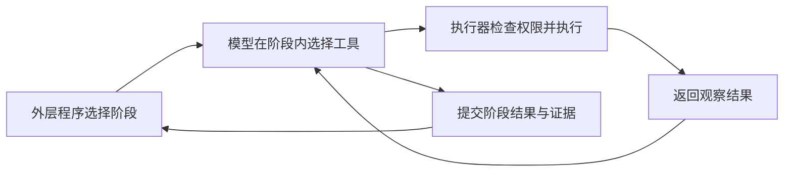
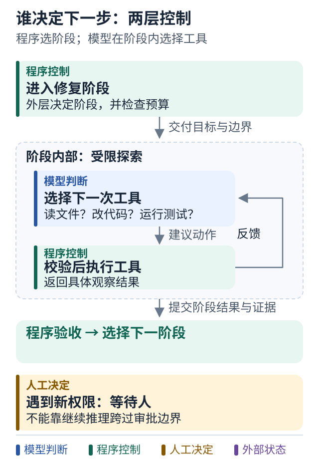

# 02 究竟是谁决定下一步

[上一课](01-task-and-done.md) · [学习路线](../README.md) · [下一课](03-model-tool-agent.md)

## 从一个选择题开始

测试失败了，系统下一步应该做什么？

可能是重新运行测试，也可能是修改代码、补充日志、询问用户，或者停止。在某个具体时刻，必须有一个部件负责选择。

这就是编排最核心的问题：**谁拥有下一步行动的决定权。**

## 三种常见安排

第一种，程序决定。你在 Python 里写 `if test_failed: repair()`。模型可能负责生成补丁，但“失败后进入修复”是代码规定的。

第二种，模型决定。程序把测试输出返回给模型，让模型选择下一个工具；模型决定先读另一个文件还是再次修改。程序仍然负责验证工具参数和权限。

第三种，混合决定。外层固定“读取、修复、测试、审批、交付”的阶段；进入修复阶段后，模型可以在允许范围内自由查文件、修改、验证。到审批边界时，模型无权自行跨过。

图中有两层控制：阶段控制和阶段内控制。你不必把全部控制权交给同一个部件。

## 图解：谁决定下一步：两层控制

跟着图走：

1. 从外圈看程序规定哪些阶段可以进入。
2. 进入修复区间，模型依据反馈选择工具。
3. 走到权限边界时离开探索区间，不能靠继续推理越过。

图的范围：教学模型：只画当前概念；真实系统还需实现正文说明的校验与故障处理。

## 固定流程并不代表完全没有智能

例如，程序固定调用“总结工单”，但总结本身需要模型理解自然语言。这里有智能处理，却没有让模型决定流程。

反过来，一个包含许多方框和箭头的图，也可以在某个节点里运行很自主的 Agent。图的形状不能直接告诉你系统有多自主。

因此，别只问“这个项目是不是 Agent”。更有用的问法是：

1. 谁决定进入哪个阶段？
2. 谁决定下一次工具调用？
3. 谁决定可以结束？
4. 谁决定某个外部动作被允许？

这四个答案可以分别是程序、模型、校验器和人。

## 用一张小表观察自己的设计

| 决策 | 适合先由谁负责 | 原因 |
|---|---|---|
| 找哪个相关代码文件 | 模型建议并在限定工作区执行 | 搜索路径难以写死 |
| 是否允许推送到远端 | 明确授权与策略检查 | 推理能力不会自动带来权限 |
| 测试失败后要不要尝试修复 | 程序预算内允许模型尝试 | 可自主，但需要停止条件 |
| 补丁是否达到验收标准 | 程序检查加必要的人审 | 需要独立可验证的证据 |

这张表是建议的起点，不是所有系统的固定分工。例如极低风险的学习练习可以更简单，真实生产变更需要更严格。

## 小练习

找出你写过的一段 Python 编排代码，把每个 `if` 圈出来。标记哪些是业务规则，哪些只是你替模型猜测的思考步骤。

业务规则通常值得保留。只为猜测模型“应该先想什么”而写的分支，可以评估是否交回 Agent 循环。

**带走一句话：编排设计首先是分配决定权，而不是选择流程图工具。**

延伸依据：[Anthropic 对 workflow 与 agent 的区分](../references/sources.md#s01)。
