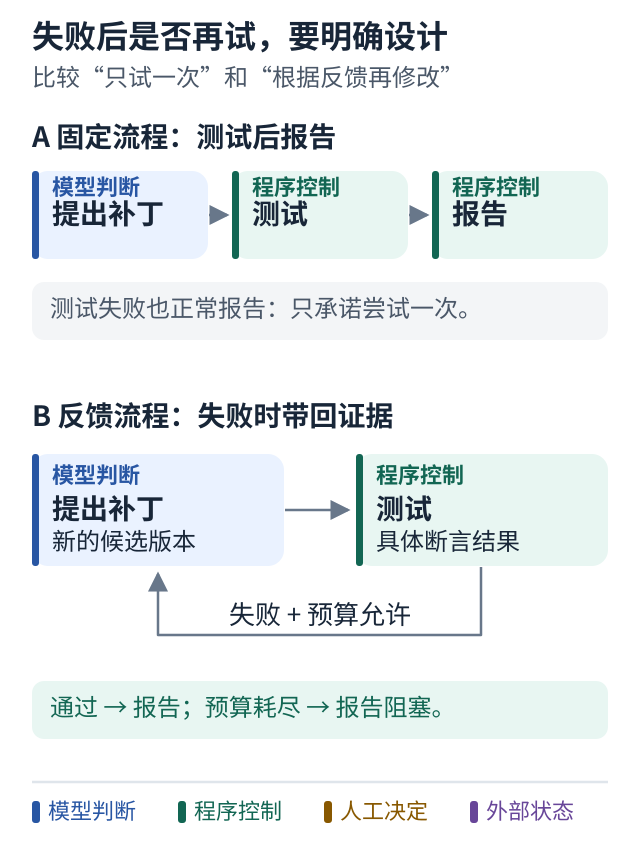

# 05 写出一条固定 Python 流程

[上一课](04-state.md) · [学习路线](../README.md) · [下一课](06-agent-loop.md)

## 先让流程容易预测

工单 1042 的最小流程是：读取问题，生成候选补丁，运行测试，返回报告。暂时不考虑模型自己决定顺序。

```python
def workflow(task):
    context = read_context(task)
    patch = propose_patch(context)
    test_result = test_patch(patch)
    return make_report(patch, test_result)
```

这是教学伪代码。四个函数尚未定义，不能把它当成完整程序直接运行。可运行的离线版本见 [fixed_workflow.py](../examples/fixed_workflow.py)。

逐行看：第一行规定入口；第二行准备输入；第三行负责提出修改；第四行验证修改；最后一行交付证据。即使 `propose_patch` 内部使用模型，步骤仍由 Python 固定。

## 这种写法有什么好处

调试时，你容易定位在哪一步失败。测试时，你可以替换一个函数来制造故障。审计时，你可以清楚说明系统一定会先完成测试再出报告。

因此，“硬编码”不是天然缺点。退款规则、生产审批、任务预算这些本来就应稳定的东西，写成清晰的程序约束往往更可靠。

真正的问题出现在你开始替未知任务预先写出所有推理路径。比如为每种测试报错写一条字符串匹配规则，再为每个新报错添加特例，系统会越来越难维护。

## 故意观察一次失败

假设 `propose_patch` 给出的实现只能解析 `"12.50"`，不能解析 `"1,234.50"`。测试失败后，上面的流程仍然会生成报告并结束。

这不一定是程序错误。如果任务契约只要求“尝试一次并报告”，它做对了。如果你期望“在预算内反复修复直到测试通过”，那么流程缺少的是反馈，不是更多角色。

先精确表达缺少什么，才能避免用多 Agent 解决一个循环本来就能解决的问题。

## 图解：失败后是否再尝试，是明确的设计选择



跟着图走：

1. 先走上轨：固定流程测试失败后仍可正常报告，并不承诺自动修好。
2. 再走下轨：只有明确加入失败反馈边，结果才影响下一次修改。

图的范围：教学模型：只画当前概念；真实系统还需实现正文说明的校验与故障处理。

## 修改哪一处可以增加能力

最小变化是把失败结果返回给修复步骤：

```text
提出修改 → 测试 → 通过则交付
              └→ 失败则带着错误再次修改
```

这里依然可以只用 Python。你不必为了第一次循环马上引入 LangGraph。

是否需要框架，要继续看：状态要不要持久化？是否需要暂停数小时？是否有并行分支？是否需要可视化运行记录？这些需求出现得越多，框架提供的基础设施越可能有价值。

## 小练习

给固定流程写一个失败路径：测试超时后，报告里至少应该包含什么？

提示：不要把“没拿到测试结果”改写成“测试没有发现问题”。

**带走一句话：固定 Python 流程适合已知步骤；先看它缺少哪种能力，再决定增加什么。**
