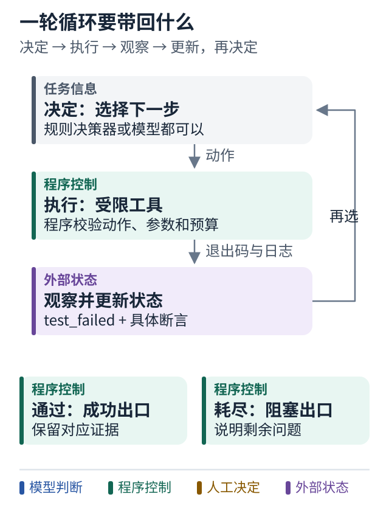

# 06 把流程变成反馈循环

[上一课](05-python-workflow.md) · [学习路线](../README.md) · [下一课](07-bounded-autonomy.md)

## 循环让结果影响下一步

上课的流程只尝试一次。现在我们让执行结果进入下一次决策。

```python
def bounded_loop(state, max_steps=5):
    for step in range(max_steps):
        action = decide(state)
        observation = execute_allowed(action)
        state = update(state, observation)
        if has_verified_result(state):
            return report(state)
    return blocked_report(state, reason="budget_exhausted")
```

这是结构示意，不是完整可运行文件。完整无模型实验见 [bounded_loop.py](../examples/bounded_loop.py)。

函数先设置有限步数预算；每步决定一个动作，执行被允许的动作，再把结果变成下一轮可见的事实；完成证据齐全时返回报告；预算结束仍未成功时，明确报告原因。这里计数的是动作步数，不能把它直接称为修复次数：一次修改和一次测试就可能占两步。

## 图解：一轮循环要带回什么



跟着图走：

1. 按决定、执行、观察、更新走一圈。
2. 把“失败”展开为具体断言，让下一轮能选择修代码还是处理环境。
3. 沿两个出口比较：拿到成功证据和预算耗尽是不同结果。

图的范围：教学模型：只画当前概念；真实系统还需实现正文说明的校验与故障处理。

## 决策器可以先不用模型

学习时，可以让 `decide` 使用简单规则：没有补丁就提出补丁，没有测试就测试，失败就修复。这样你能把注意力放在循环机制上。

等流程正确，再把其中部分规则替换成模型决策。模型更适合处理无法预枚举的选择，例如根据错误堆栈决定读取哪个文件。

不过，模型不需要决定所有事。是否超过预算、是否拥有发布权限、是否存在测试证据，这些可以继续由程序计算。

## 反馈必须足够具体

如果工具只返回 `False`，模型不知道是断言失败、环境缺少依赖，还是测试超时。三种情况的下一步完全不同。

更合适的结果可以包含：

```python
observation = {
    "kind": "test_failed",
    "command": "unit_tests",
    "candidate_digest": "actual-candidate-digest",
    "failures": ["thousands_separator_case"],
}
```

这个对象既能供程序判断，也能给模型提供修复方向。实际错误日志可以另存为产物，按需给模型摘要和相关片段，不必每轮重复全部日志。

## 循环不一定是 Agent

一个恒定重复三次的网络重试，也是循环，但没有目标驱动的行动选择。本教程把“根据观察选择下一动作”的反馈循环作为理解 Agent 的实用起点。

不必为术语边界争论太久。检查它是否真正利用了反馈，比争论名字更有帮助。

## 小练习

如果第一次修改成功，测试通过以后为什么还不能立即推送远端？分别写出“结果够不够好”和“动作被不被允许”两条判断。

**带走一句话：自主循环的基本单位是决定 动作 观察 更新，而不是一串角色对话。**

参考：[Anthropic 的 Agent 反馈循环解释](../references/sources.md#s01)。
