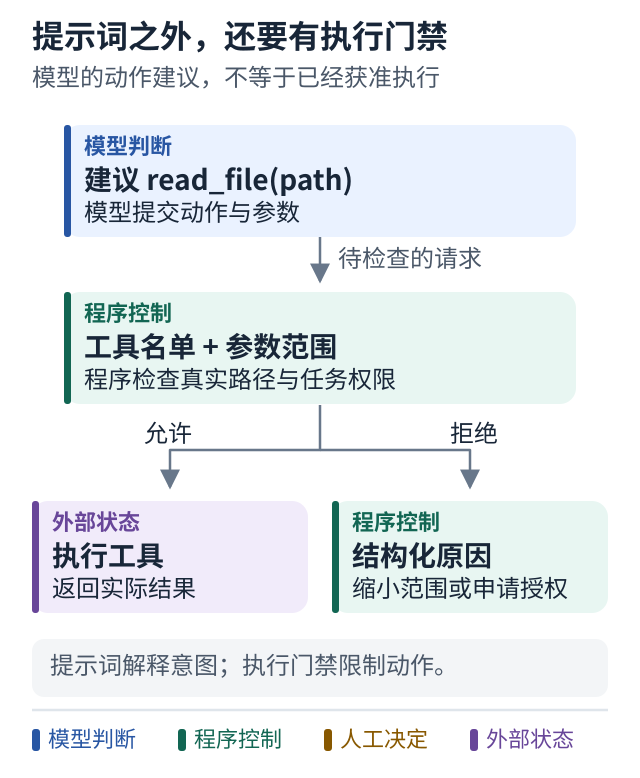

# 07 给自主性画出边界

[上一课](06-agent-loop.md) · [学习路线](../README.md) · [下一课](08-retry.md)

## 自主性需要被具体描述

“让 Agent 自主修 bug”仍然太抽象。它是可以读任何目录，还是只能读指定仓库？可以安装依赖吗？可以修改测试吗？可以推送代码吗？

把自主性拆成三个容易观察的范围：**可以决定的事情、可以调用的能力、必须停止的条件。**

对工单 1042，可以允许它自行选择相关文件、提出补丁、在工作区内重复测试；同时禁止读取凭据、修改部署配置，以及未经授权发布。

## 提示词和强制检查各做什么

提示词可以解释意图：“保持修复范围小，不要随意改测试来掩盖错误。”这有助于模型选择合理行动。

但是，如果你不希望它读取某个目录，就应该由工具或沙箱限制读取范围。如果必须审批才能发布，就让发布工具检查有效审批。只在提示词里写“请先问我”，不能替代执行端控制。

```python
def execute_allowed(action, policy):
    if action.tool not in policy.allowed_tools:
        return Denied("tool_not_allowed")
    if not policy.accepts(action.arguments):
        return Denied("arguments_out_of_scope")
    return dispatch(action)
```

这段也是教学结构。现实实现还要考虑路径规范化、符号链接、命令注入、网络和进程权限，不能仅靠字符串前缀判断工作区安全。

## 图解：提示词之外，还要有执行门禁



**跟着图走：**

1. 先看模型提出的动作，不把它当作已经执行。
2. 经过工具与参数范围检查后，只有允许分支能到达执行器。
3. 拒绝结果回到任务，要求缩小范围或取得必要授权。

**图的范围：**简化边界图。路径、进程、网络与凭据限制需要实际实现，不能只靠工具名称。

## 权限要与责任匹配

诊断者通常只需读代码和日志，不必拥有写权限。实现者需要修改隔离工作区，但不一定需要发消息。通知组件需要发送被批准的状态摘要，但不需要读取整个代码仓库。

这样拆分有两个好处：错误影响范围变小，排查问题时也更容易知道哪个部件可能做过什么。

工具返回内容、工单正文和仓库文件都可能包含“忽略之前要求”之类文字。它们是任务数据，不能自动升级成系统权限。读取了一个工单，不代表工单作者能够授权系统访问新资源或发布代码。

## 停止不是失败的耻辱

一个可靠系统必须能说：我卡在权限、输入、预算或环境上，需要某个具体条件才能继续。

好的停止报告包括已经完成什么、当前证据、阻塞原因、可选下一步。差的停止报告只有“遇到问题，请重试”。

## 小练习

为“只负责测试的 Agent”列出三个允许工具和三个禁止工具。然后问：这些禁止是写在提示词里，还是工具端真的拒绝？

**带走一句话：自主性越强，边界越应由可执行规则表达。**
