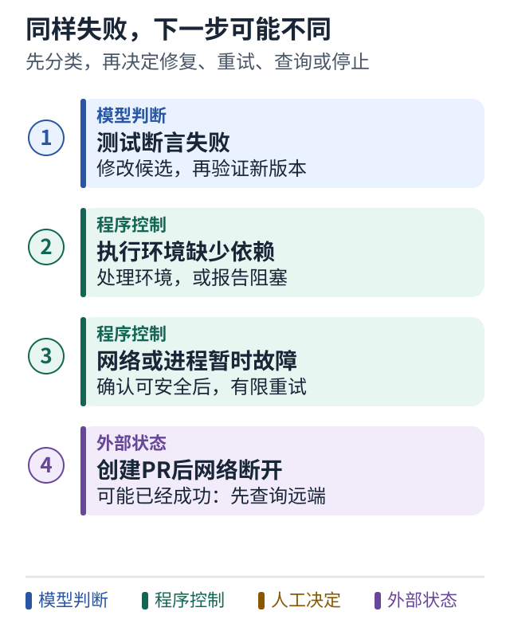

# 08 失败之后该重试什么

[上一课](07-bounded-autonomy.md) · [学习路线](../README.md) · [下一课](09-repository-map.md)

## 相同的失败提示可能来自不同问题

`run_tests` 没有成功，至少可能有三种原因：测试发现代码错误；执行环境缺少依赖；网络或进程暂时异常。

如果是代码错误，原样重跑通常没有帮助，应该修改候选补丁。如果是依赖缺失，应该修复环境或报告阻塞。如果是短暂故障，有限次数的重试可能合理。

所以先做分类，再选择重试。不要对每个异常都套一个无限 `while True`。

## 修复与重试是不同操作

**重试**一般保持同一输入和意图，再做一次动作。**修复**先改变了输入，再执行新的尝试。

例如，第二次测试同一份补丁是重试；更改代码后再测试是新候选的验证。它们应该有不同的尝试编号和证据绑定，避免把第一份补丁的通过结果误用到第二份补丁。

## 图解：同样失败，下一步可能完全不同



**跟着图走：**

1. 从失败证据选择卡片，不要统一套重试循环。
2. 遇到可能已产生外部影响的断网，先查结果；原样再做可能创建第二份。

**图的范围：**教学模型：只画当前概念；真实系统还需实现正文说明的校验与故障处理。

## 外部动作最危险的时刻

假设系统已经发送通知，但在保存 `sent=true` 前崩溃。恢复后看不到记录，于是再发一遍。用户收到重复通知。

你可能想把顺序调过来：先保存 `sent=true` 再发送。这样如果保存后、发送前崩溃，通知就永久丢了。

这说明问题不是交换两行代码能完全解决的。你需要管理“待发送、发送中、已确认、结果不确定”等状态，并尽可能利用接收方的幂等键或可查询的消息标识。

## 幂等性用白话解释

同一意图执行多次，外部可见结果应等效于执行一次。比如“确保工单 1042 有一条指定结果通知”，比“再创建一条通知”更容易设计成幂等操作。

一个可用的键可能由任务、事件版本、接收人和消息用途组成：

```text
demo-1042 : result-v2 : owner-7 : completion-summary
```

只用 `task_id` 不够，因为同一任务后面可能有新的结果需要通知。随机 UUID 也可以用作幂等键，前提是为同一个意图生成一次、保存并在重试时复用；如果每次重试都生成新值，就会被当作不同意图。

不要因此宣称实现了全系统“恰好一次”。如果外部系统不提供必要支持，在某些崩溃边界上仍需查询、对账或人工处理。

## 小练习

分别处理三个事件：测试断言失败、测试进程超时、创建 PR 后网络断开。哪些可以直接重试？哪个必须先查远端是否已经成功？

**带走一句话：先判断失败类型，再决定重试 修复 查询还是交给人。**

工程依据：[AWS 关于幂等 API 的说明](../references/sources.md#s12)。
