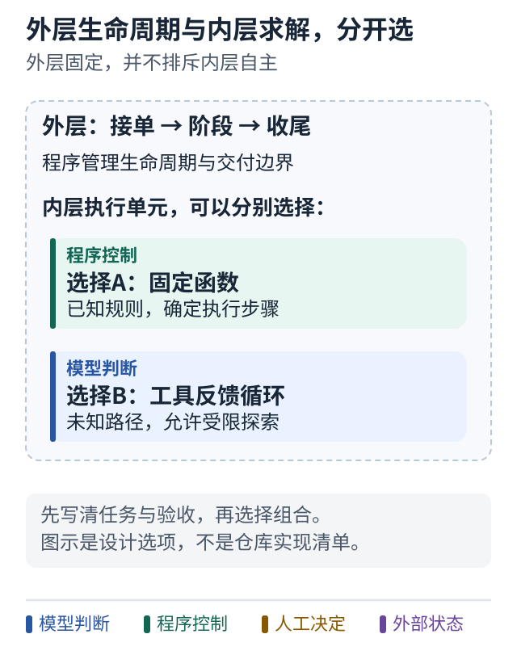

# 09 底盘与单会话执行分别负责什么

[上一课](08-retry.md) · [学习路线](../README.md) · [下一课](10-chassis-flow.md)

## 现在开始读一个真实项目

前八课建立了任务、控制、状态和反馈的概念。接下来用公开项目 [TIMPICKLE/devops-agent-chassis](https://github.com/TIMPICKLE/devops-agent-chassis) 观察这些概念怎样落到代码中。

本部的源码结论固定在提交 `63f8496eac20828f0712c8a53e2299a9b7baf8d8`。链接指向该版本，避免未来分支变化让描述对不上。我们是在阅读公开源码与 CI 状态，未在本教程研究中重新运行它的测试。

## 先理解底盘这个比喻

一辆车的底盘承担支撑和基本运转结构，但不决定每一次方向盘转向。这个项目可以类似地理解：让任务入口、运行上下文、编排器、完成判据和失败处理遵循共同接口。

你可以先记住三个核心问题：

- 任务从哪里来：`TaskSource`。
- 任务怎样被执行：`Orchestrator`。
- 执行结果算不算成功：`DoneCriteria`。

它们的名称来自项目，意义则是前面已经学过的任务入口、控制权和验收。[源码：主运行器](https://github.com/TIMPICKLE/devops-agent-chassis/blob/63f8496eac20828f0712c8a53e2299a9b7baf8d8/src/agent_chassis/chassis.py#L177-L336)

## 两个维度不要揉成一个选择题

**外层编排方式**回答任务怎样分阶段、调用执行单元和收尾。**内层推理方式**回答当前执行单元如何计划、选工具和利用反馈。

一个固定状态机的“修复”节点里，可以放一个 ReAct 循环。ReAct 这个名字在这里可以先简单理解为：根据观察反复决定下一次行动。外面固定，里面探索，两者可以同时成立。

所以，“用状态机还是用 Agent”这个问法经常过于粗糙。更准确的是：“哪些边界由状态机约束，哪些区间交给 Agent 探索？”

## 图解：外层生命周期与内层求解是两个选择



**跟着图走：**

1. 先选外层需要管理哪些边界。
2. 再单独选择内层用规则函数还是自主探索；两个答案可以组合。

**图的范围：**教学分层：不表示所有组合已经由某个仓库实现。固定版本事实见本课源码链接。

## 一个单会话方案放在哪里

另外考虑一种**独立构造的通用教学方案**：外层服务把任务交给一个 Agent 会话，让它在会话内部查代码、改代码和测试。外层负责进程、期限、结果存储和验收。

```text
外层底盘式设计：接单 → 选择编排器 → 执行 → 独立验收
单会话教学设计：接单 → 运行一个自主会话 → 收集结果 → 独立验收
```

这不是某个未公开项目的实现说明。它只是帮助比较“下一步决定放在外层还是会话内”的设计模型。第 12 课会从公开概念把它搭出来。

## 小练习

在你熟悉的代码里找出任务入口、执行过程和完成检查。如果它们全在一个函数里，先用注释标出边界，不急着拆文件。

**带走一句话：外层生命周期和内层推理是可以独立选择的两个维度。**
