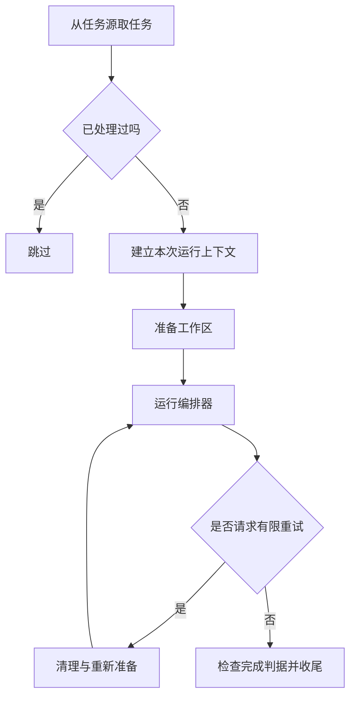
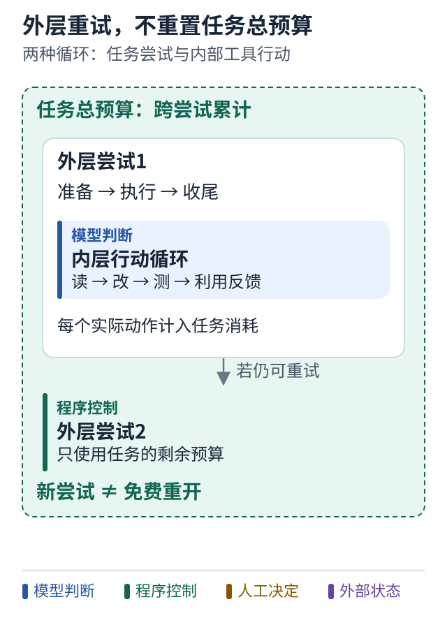

# 10 沿着底盘的一次任务走一遍

[上一课](09-repository-map.md) · [学习路线](../README.md) · [下一课](11-done-criteria.md)

## 不要从全部类名开始

读框架容易迷失在目录和抽象接口里。更有效的方法是追踪一个任务：它从哪里进入，被谁处理，什么时候结束。

下图是对公开底盘运行器的缩减解读，省略了观察者和注入等辅助步骤：

实际入口包括 `build()`、`run()`、`_run_task()`。`build()` 检查必要组件；`run()` 获取任务并检查是否已见；`_run_task()` 组织工作区、尝试和结果收尾。[固定版本源码](https://github.com/TIMPICKLE/devops-agent-chassis/blob/63f8496eac20828f0712c8a53e2299a9b7baf8d8/src/agent_chassis/chassis.py#L177-L336)

## 同一个任务有两种循环

内层可能是模型看错误、改代码、再测试的循环。外层也可能在整次执行异常后，按照失败策略清理并重试。

它们不能共用一个含糊的“重试次数”。一次外层重试可能包含多次模型工具调用。如果每次外层重试都把全部预算归零，整个任务可能意外消耗很多资源。

公开 ReAct 实现区分迭代、工具调用、批次数量与并行上限，并保留跨重试的任务级行动预算。这让你能看见“同一个限制”其实可能包含多个不同维度。[推理循环源码](https://github.com/TIMPICKLE/devops-agent-chassis/blob/63f8496eac20828f0712c8a53e2299a9b7baf8d8/src/agent_chassis/orchestration/reasoning.py#L285-L377)

## 图解：不要让外层重试重置整项任务预算

跟着图走：

1. 先看最外圈，它代表任务总量。
2. 进入一次外层尝试，再数内层的工具动作。
3. 外层重试后仍要核对累计消耗，不能把“新尝试”当成免费重开。

图的范围：依据本课固定版本的双层循环与任务级行动预算简化；图中不指定实际限额。

## 上下文里的事实与笔记

`RunContext` 把 `facts`、`model_notes`、工具调用、模型调用和验证记录分开。直观地说：系统核查到什么，模型推测什么，以及程序做过什么，应能区分来源。[上下文定义](https://github.com/TIMPICKLE/devops-agent-chassis/blob/63f8496eac20828f0712c8a53e2299a9b7baf8d8/src/agent_chassis/contracts.py#L347-L458)

这是一种有帮助的数据设计，但字段叫 `facts` 不会使内容天然可信。自定义组件仍可能写错。重要的业务验收需要重新读取真实文件、测试结果或远端状态。

## 看见一个接口以后还要看调用点

项目有 `PermissionBoundary.check`，用于拒绝不具备能力的调用。但源码中的 `ToolBox.call` 并不会自动检查所有 capability。实际受控 wrapper 必须调用检查。

因此，“存在权限类”和“每条执行路径都受到限制”是两个不同结论。你应从工具入口一直追到真正执行的位置，确认检查没有被绕开。它也不等于操作系统级沙箱。[权限定义与示例](../references/sources.md#r03)

## 小练习

给运行图加一个“模型说停止”的箭头。它应该直接到成功，还是先进入完成检查？下一课解释原因。

**带走一句话：追踪一次任务，比记住所有类名更容易读懂底盘。**
