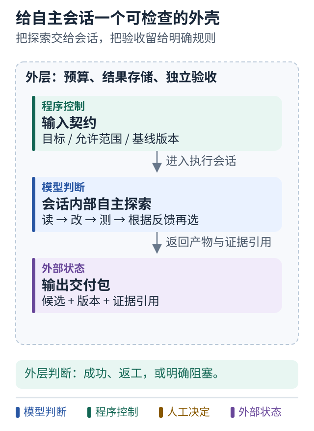

# 12 设计一个通用的单会话执行器

[上一课](11-done-criteria.md) · [学习路线](../README.md) · [下一课](13-why-graph.md)

## 把调查路线交给一个会话

前面公开底盘的接口很清楚，但你可能仍想问：能不能把任务直接交给一个能力强的编码 Agent，让它自己决定读什么、怎么改、测几次？

可以把这作为一种设计选择。下面从零构造一个通用教学方案，不对应某个特定私有项目，也不是可直接部署的完整服务。

```text
任务入口
   ↓
创建受限工作区并保存任务
   ↓
启动一个 Agent 会话
   ├─ 读文件
   ├─ 提出修改
   ├─ 运行允许的测试
   └─ 根据结果继续
   ↓
收集产物和执行记录
   ↓
外层验收并报告
```

自主性集中在会话内，外围服务保持相对小。它可以由某个 SDK、CLI 或托管运行时承载，具体选择取决于工具、环境与恢复需求。

## 少写步骤之后责任去了哪里

你不再亲自写“先 grep 再读文件再运行测试”的每条分支，但这些行为仍然在某处发生。它们由 Agent 运行时、提示词、可用工具和模型决策共同产生。

因此要检查的对象变成：会话怎么接收工具结果、超时怎么取消、产物怎么取出、失败时能留下多少证据，以及外层如何判断完成。

“让 Agent 自己做”减少的是你手写解题路线的数量，不会自动消除进程、权限、状态和验收的需求。

## 什么时候这很合适

当任务边界清楚，调查路径变化大，而现有编码 Agent 已提供好的文件和工具体验时，单会话执行器能减少重复建设。

当任务包含长期等待、多角色审批或多个外部系统的状态同步时，外层仍然需要清晰的生命周期。你可以把会话当成其中的一个执行阶段，不必要求一个会话永远活着等人回复。

这里的“外层”指活动会话之外的责任边界，也可以由产品自带的持久调度服务承担，不一定要另建平台；[Claude Code 案例](../cases/08-claude-code-collaboration.md) 展示了这种区别。

## 会话日志与业务状态分开

会话日志记录每次输入、调用和输出；业务状态记录任务等待什么、哪些证据有效、下一次事件应该触发哪里。两者相互引用。

Anthropic 的 Managed Agents 公开设计讨论了 session log、harness 和 sandbox 的分离。这里的 harness 可以理解为“让模型持续使用工具工作的运行支架”。托管这些基础设施并不自动替你的应用定义验收和授权。[官方工程说明](https://www.anthropic.com/engineering/managed-agents)

## 图解：给自主会话一个可检查的外壳



**跟着图走：**

1. 把明确输入交给会话，允许它在范围内选择调查路径。
2. 会话结束时收集产物与证据，不只收一句“完成”。
3. 外层根据合同验收，再决定成功、返工或阻塞。

**图的范围：**独立构造的通用教学设计，不代表 Pure Agent Drive 当前实现的全部能力。

## 小练习

如果这个会话退出时只留下“完成了”的最后一句话，外层应该做什么？设计一个最小交付清单，使它至少能拿到候选产物、测试结果和未解决问题。

**带走一句话：你可以把解题路线交给会话，但应保留任务责任和验收边界。**
