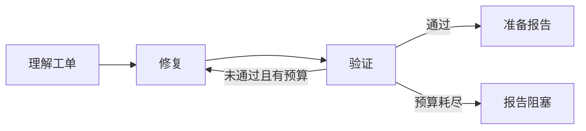

# 13 什么时候值得把流程画成图

[上一课](12-single-session.md) · [学习路线](../README.md) · [下一课](14-first-langgraph.md)

## 为什么前面的 Python 开始变复杂

固定流程只有四步时，一个函数足够清楚。现在我们增加：测试失败要返工，需要人确认时暂停，超时需要恢复，独立审查可以并行，取消任务时要阻止后续发布。

如果这些规则全散在嵌套的 `if`、循环和回调里，阅读者很难看出哪些阶段允许互相转换。

图的价值就在这里：**把“执行什么”和“接下来去哪”显式拆开。**

## 节点 状态 边

LangGraph 的基本概念可以用三句话理解：

- 节点：处理当前状态的函数。
- 状态：任务到目前为止的相关信息。
- 边：决定节点之后接到哪里。

节点可以运行模型，也可以只是校验字段。你不必把每个节点都叫 Agent。[官方 Graph API](https://docs.langchain.com/oss/python/langgraph/graph-api)

## 同一条流程换一种表达

这张图本身没有提高模型能力。它让路由和结束条件变得可检查。如果模型不知道怎么修金额解析，画成图后仍然可能不知道。

所以你评估迁移的收益时，应问：恢复更容易了吗？分支更清楚了吗？状态更容易测试了吗？而不只是“现在用了一个 Agent 框架”。

## 什么时候不必引入图

只有一两次模型调用、没有复杂等待、失败后重新运行成本很低的小脚本，普通 Python 往往更容易理解。

即使准备将来使用图，也可以先把函数输入输出设计清楚。好的函数合同能直接迁移，混杂了网络、状态更新和业务判断的巨型函数则会把复杂性一并带进图。

## 小练习

用纸画工单 1042 的三个节点：修复、验证、报告。标出失败边，再写出哪条边由程序决定，哪条边允许模型建议。

**带走一句话：图首先改善流程的表达与运行控制，不会自动改善推理质量。**
