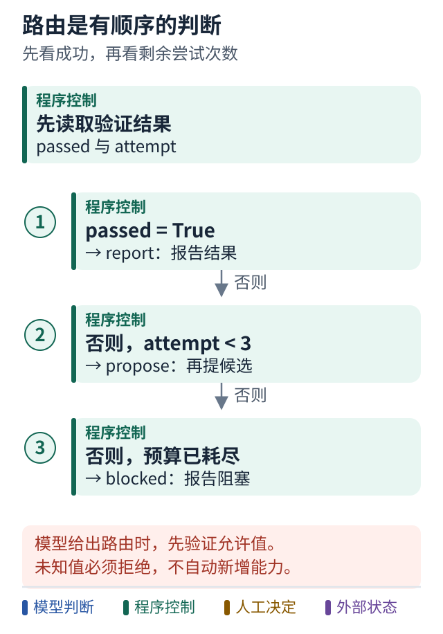

# 15 条件路由表达反馈

[上一课](14-first-langgraph.md) · [学习路线](../README.md) · [下一课](16-persistence.md)

## 上一张图少了反馈

第 14 课无论验证成功还是失败都会结束。现在让验证结果决定后续节点。

先给状态补一个 `attempt`，表示已经尝试多少次。每次 `propose` 更新候选时也增加次数。再定义路由函数：

```python
def after_verify(state):
    if state["passed"]:
        return "report"
    if state["attempt"] < 3:
        return "propose"
    return "blocked"

builder.add_conditional_edges(
    "verify",
    after_verify,
    {"report": "report", "propose": "propose", "blocked": "blocked"},
)
```

这是需要装入完整图的教学片段；`report`、`blocked` 节点需注册，原来 `verify → END` 的无条件边也应移除。否则你并没有把旧流程替换成新流程。

[完整装配文件](../framework_samples/langgraph_complete.py) 展示 attempt 初始化与递增、节点注册、条件边和结束边。它是可供核对的完整示意，尚未完成框架运行验证。

接口依据：[LangGraph 图 API 使用指南](https://docs.langchain.com/oss/python/langgraph/use-graph-api)。

## 图解：路由是有顺序的判断



跟着图走：

1. 先判断通过与否，成功时进入报告。
2. 未通过才看预算，有余量返回提出候选，否则阻塞。
3. 若路由来自模型，先验证允许值；不要动态赋予未注册能力。

图的范围：对应本课条件路由片段；完整图还需注册节点、结束边并移除旧的无条件结束边。

## 模型可以决定哪些路由

对于“接下来调查输入清洗还是数值转换”，可以让模型提出结构化选择。程序验证候选值属于允许列表，再路由到相应工具或节点。

对于“没有审批能不能发布”，不应该让模型临时自由判断。程序应检查授权记录。

二者可以共存。你可以让模型决定下一次调查方向，同时让图强制执行预算和审批边界。

## 路由函数不要偷偷做很多事

把发送消息、改文件和增加计数都藏在 `after_verify` 里，会使“判断下一步”拥有意外副作用。调试和恢复都会更难。

更清楚的分工是：节点产生明确结果，路由读取状态决定去向，实际动作在命名清楚的节点执行。不是所有框架都要求这样，但这是适合初学者的设计习惯。

## 图循环也需要结束依据

你既需要成功出口，也需要无法继续时的出口。设置图运行的循环保护可以避免无限执行，但业务层仍然应该说明为什么预算耗尽、哪些进展已经得到。

“框架抛了递归限制异常”通常不是你想交给用户的完整结果。

## 小练习

模型给出不存在的路由名称 `deploy_now` 时，你的代码该如何处理？不要静默映射为成功，也不要给它自动新增工具。返回结构化错误或进入可解释的阻塞路径。

**带走一句话：条件边可以利用模型判断，但重要业务约束应由可验证规则守住。**
