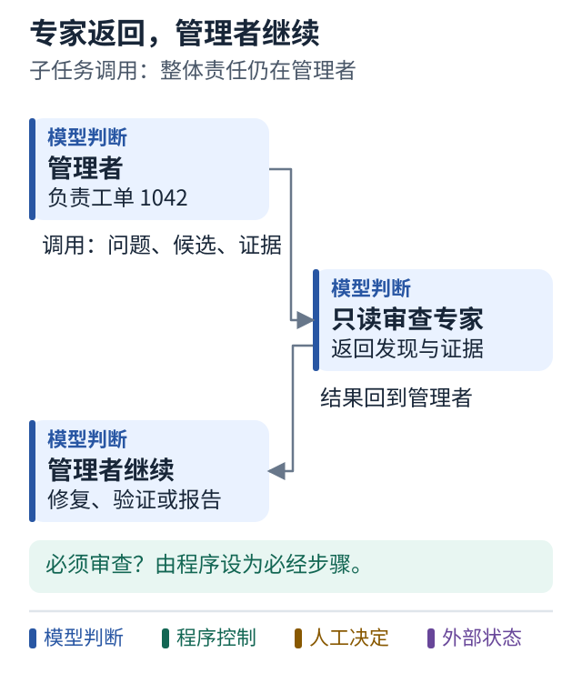

# 18 管理者如何调用专家

[上一课](17-why-multi-agent.md) · [学习路线](../README.md) · [下一课](19-handoff.md)

## 先采用最容易理解的协作方式

管理者负责工单整体，把一个有限问题交给专家，专家返回结果，管理者继续。可以把专家理解为一个能力更复杂的工具。

对于工单 1042，管理者可以问审查者：“这份金额解析补丁是否错误接受了非法千分位格式？”审查者回答风险和证据，不接管整项工单。

## OpenAI Agents SDK 的具体表达

下面是按官方接口写的示意片段，未执行模型调用。`MODEL` 需要配置为账户可用模型，调用还需正确配置 SDK 与凭据。

```python
from agents import Agent, Runner

reviewer = Agent(
    name="Patch reviewer",
    model=MODEL,
    instructions="根据给定需求和补丁检查回归风险。缺少证据要指出，不声称运行过测试。",
)

manager = Agent(
    name="Fix coordinator",
    model=MODEL,
    instructions="负责整体任务。需要补丁风险审查时调用 review_patch，再汇总结论。",
    tools=[reviewer.as_tool(
        tool_name="review_patch",
        tool_description="审查提供的补丁与测试证据，返回风险，不接管任务。",
    )],
)

# 在 async 函数内：
# result = await Runner.run(manager, task_with_diff_and_evidence)
```

接口依据：[Agent 对象](https://openai.github.io/openai-agents-python/agents/)、[多 Agent 编排](https://openai.github.io/openai-agents-python/multi_agent/)。

## 图解：专家作为工具：结果回到管理者



跟着图走：

1. 管理者发出边界明确的子问题，把当前候选和证据交给专家。
2. 专家返回发现后，控制回到管理者，由管理者推进整项任务。
3. 如果审查必须执行，应设业务门禁；可选工具不保证被模型调用。

图的范围：教学模型：只画当前概念；真实系统还需实现正文说明的校验与故障处理。

## 哪一部分是自主的

`reviewer` 定义专家的行为；`as_tool` 把它包装成管理者能选择的工具；`tools` 把这个工具放进允许列表；`Runner` 驱动运行。

模型根据工具说明判断是否调用，以及提供什么输入。运行时实际启动专家，拿到结果再交还管理者。控制权回到管理者，由它决定接下来补充验证还是形成报告。

所以工具描述影响“何时可能被选中”，却不能保证“一定执行”。如果独立审查是强制业务要求，就把它写成外层必经步骤，而不是仅在提示词中说“需要时请审查”。

## 给专家足够但有限的输入

一个可用的委派请求应说清：问题、候选版本、相关 diff、已有测试、期望输出、允许操作和预算。

输出可以要求分为“发现的问题、证据位置、不确定项、建议下一步”。避免只返回 `PASS`，否则管理者无法判断审查覆盖了什么。

同时不必把全部聊天历史交过去。过去十轮无关探索会占用上下文，并可能掩盖当前真正的问题。

## 小练习

如果 reviewer 返回“没发现问题”，但没有收到补丁，你的管理者应如何处理？把它当作缺少输入或无效审查，而不是批准。

**带走一句话：专家工具帮助管理者完成一个子任务，整体责任仍留在管理者。**
