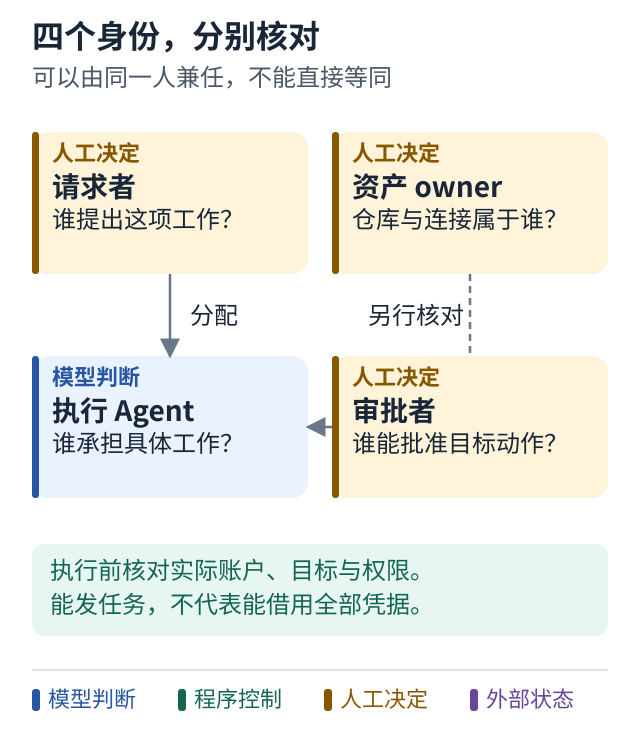

# 24 给数字员工写一份岗位说明

[上一课](23-human-approval.md) · [学习路线](../README.md) · [下一课](25-failure-drills.md)

## 名字和头像解决的是识别

把一个 Agent 放进团队聊天里，大家可以认出它、给它发任务。但这还没有回答：谁能指挥它，谁的机器和凭据在执行，谁为结果负责。

数字员工的设计，应该从一份可执行的岗位说明开始。

## 一份最小岗位说明

以“补丁准备助手”为例：

- 负责：读取明确工单，在指定仓库工作区准备补丁和测试报告。
- 输入：任务 ID、仓库、基线版本、验收条件。
- 可用能力：读代码、改限定文件、运行允许测试。
- 不确定时：报告缺少信息，等待任务负责人回应。
- 交付：补丁、证据、未覆盖风险。
- 发布：只有取得对应动作授权后，由受控执行器进行。

这份说明能映射到代码中的输入 schema、工具清单、状态、验收和审批，不只是给模型一个好听的人设。

## 多人环境里的四个身份

**请求者**提出工作。**资产 owner**拥有仓库、电脑或服务账户。**执行 Agent**承担被分配的工作。**审批者**有权批准特定动作。

一个人可以承担多个身份，但系统不能默认任何发言者都拥有所有权。尤其在共享聊天室里，某人能 @ 一个 Agent，不表示他可以借用该 Agent owner 的全部凭据。

Multica 提供一个具体例子：调用者、Agent owner 和审计归属分别记录；第三方应用连接还可能属于 Agent owner。谁能启动 Agent，与这次动作实际使用谁的连接，需要分别追踪。[固定版本身份与连接代码](../references/sources.md#p07)

## 图解：谁提出任务，不等于用了谁的权限

跟着图走：

1. 按四张卡填人或服务，不要用一个“当前用户”代替全部身份。
2. 沿请求走到执行时，检查实际使用的资产和账户属于谁。
3. 最后核对谁有权批准目标动作；能发任务不能自动借用全部凭据。

图的范围：教学模型：只画当前概念；真实系统还需实现正文说明的校验与故障处理。

## 共享空间和共享上下文

团队需要共同看到任务状态、产物和重要决定，但不应把所有房间的聊天和文件无条件送给每个 Agent。

先定义任务属于哪个权限范围，再决定检索和交接能带出哪些内容。把一个 Agent 加入新房间，不应自动复制旧房间全部记忆。

如果未来增加共享知识板，可以只发布有证据的发现、失败路径和更正。知识的有效版本、来源及可见范围，比一味增加长期记忆容量更重要。

## 谁对整项任务负责

假设诊断者、实现者和验证者都完成了自己的一部分，却没有人检查整体是否达到用户目标。系统仍然失败。

为每项任务指定一个整体负责人。它可以是人，也可以是协调服务，但职责要清楚：追踪依赖、检查证据、处理阻塞、向用户交付，并在必要时请求决定。

## 小练习

同事在群里说“用你电脑上的凭据部署一下”。请求者、资产 owner 和审批者是否相同？还缺哪些授权证据？

**带走一句话：数字员工需要岗位 责任 权限和交付闭环，聊天身份只是入口。**

可选短案例：[Meta Muse 的主动与授权](../cases/03-meta-muse.md)、[Multica 的任务与运行](../cases/04-multica.md)。它们解决的层次与权限假设不同，不应拼成一个未经验证的万能架构。
