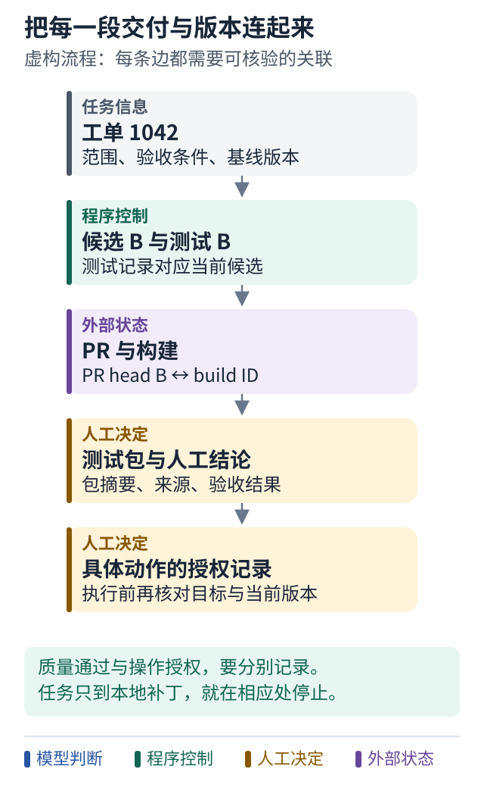

# 30 完整复盘一次人机协作任务

[上一课](29-evolution.md) · [学习路线](../README.md) · [下一课](31-design.md)

## 从工单到交付的教学设计

现在把各课装在一起。以下是虚构的端到端流程，不是任何一个仓库的现成功能。为展示长期等待，假设任务已明确授权走到“准备 PR 与测试包并等待人工验收”。合并另需明确授权。

### 第一个时刻 收到任务

入口验证事件来源，确认工单 1042 的仓库和范围。相同事件再次到达时，关联已有任务。原始问题是千分位金额解析失败，验收规则还包括拒绝非法分组。

系统保存基线代码版本，建立工作区。此时状态可以很简单：`running`。

### 第二个时刻 Agent 尝试修复

实现者提出“删除全部逗号再解析”。目标输入通过，但 `12,34.50` 也被错误接受。测试结果回到循环，Agent 看到具体失败，改成先验证格式再解析。

这解释了为什么目标测试和回归测试都重要。实际离线示例用 `Decimal` 表示金额，避免把二进制浮点近似问题混进本课的格式问题。

### 第三个时刻 独立核验

程序运行规定测试，并把证据绑定到当前候选。只读 reviewer 检查范围与风险，返回意见和证据，不自行批准发布。

如果任何必需验证没有完成，继续修复或报告阻塞。模型一句“已经好了”不会跳过这个门。

### 第四个时刻 创建交付物

受控执行器检查创建 PR 的授权，查询同一任务是否已有 PR，再执行必要动作并保存远端 ID。如果响应超时，状态记为结果未知，先查询再决定是否重试。

构建针对明确代码版本触发，保存 build ID。任务进入 `waiting_for_build`，当前模型运行可以结束，不需要一直占着一个进程轮询。

### 第五个时刻 构建结果回来

事件消费者检查 build ID 和源码版本。旧版本构建通过不能批准当前版本。正确构建的产物成为测试包，保存包摘要及来源。

系统生成测试说明和人工测试请求，通知被授权的测试者，然后进入 `waiting_for_human`。通知被渠道接受并不代表人已经看过。

### 第六个时刻 人回复

如果人反馈失败，保留反馈与原包，回到修复。新补丁生成新包，旧包的通过记录不能借给新包。

如果人测试通过，系统记录质量结论。若任务范围只到这里，就交付并结束；若还要求合并，必须另外核对授权、CI、PR 当前版本和分支保护。

### 最后一个时刻 诚实报告

报告应说清已完成到哪一步，给出实际产物和验证记录，列出仍需决定的事项。例如：“补丁与测试包已准备，人工验收通过；尚待合并授权。”

不要用“全部完成”掩盖仍在等待的最后一步。

## 图解：把交付链上的版本一段段连起来



**跟着图走：**

1. 先沿工单、补丁、构建、测试包找对应标识，检查是否还是同一份交付。
2. 在人测试后区分质量结论与操作授权，两者不能互相代替。
3. 若用户只要本地补丁，在补丁和必要验证处停止，不生成后续外部步骤。

**图的范围：**虚构端到端设计。每条连接表示可核验的关联，不声称某个产品已实现整条链。

## 一张简化职责图

```text
人：定义目标 ─────────────── 测试反馈与授权
       ↓                          ↑
外层：接单 → 验证 → 交付准备 → 等待 → 核验回复 → 收尾
                ↑
内层：观察 → 选工具 → 修改 → 测试 → 反馈循环
```

## 小练习

把这个流程的停止点改成“仅交付本地补丁”。哪些阶段应删除？答案应依据用户范围，而不是认为流程越长越完整。

**带走一句话：可靠协作是多个局部能力按任务契约组合后的闭环。**
